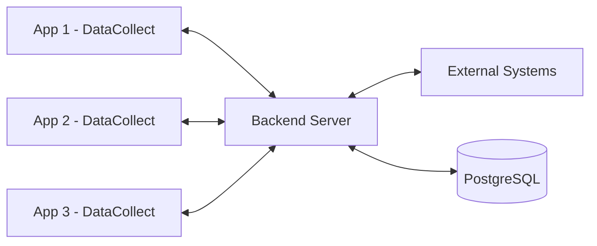

# ID PASS DataCollect

[](LICENSE)
[](https://www.typescriptlang.org/)
[](https://nodejs.org/)

> A robust offline-first data management system for household and beneficiary data with event sourcing and synchronization capabilities

## 🚀 Features

- **🔌 Offline-First Architecture** - Works seamlessly without internet using IndexedDB
- **🔄 Two-Level Synchronization** - Client ↔ Server ↔ External system sync
- **📝 Event Sourcing** - Complete audit trail of all data changes
- **🏢 Multi-Tenant Support** - Single backend serving multiple applications
- **🔐 JWT Authentication** - Secure API access with role-based permissions
- **🎯 TypeScript Throughout** - Type-safe development experience
- **📊 Conflict Resolution** - Automatic handling of data conflicts during sync
- **🔧 Extensible Architecture** - Custom event types and sync adapters

## 📦 Project Structure

This monorepo contains four main packages:

- **`packages/datacollect`** - Core library for offline data management
- **`packages/backend`** - Central sync server with PostgreSQL
- **`packages/admin`** - Vue.js admin interface for server management
- **`packages/mobile`** - Mobile application built with Vue.js and Capacitor

## 🚀 Quick Start

For setting up on Docker, see the [docker/README](docker/README.md)

### Prerequisites

- Node.js 20.x
- PostgreSQL 15+ (for backend)
- npm or yarn

### Installation

1. Clone the repository:

```bash
git clone https://github.com/idpass/idpass-data-collect.git
cd idpass-data-collect
```

2. Install dependencies and build:

```bash
# Install root dependencies
npm install

# Build datacollect library
cd packages/datacollect
npm install
npm run build

# Install backend dependencies
cd ../backend
npm install

# Install admin dependencies
cd ../admin
npm install
```

3. Set up environment variables:

```bash
cd ../..
cp .env.example .env
# Edit .env with your configuration
```

4. Start the development servers:

```bash
# Terminal 1: Backend server
cd packages/backend
npm run dev

# Terminal 2: Admin interface
cd packages/admin
npm run dev
```

## 📖 Documentation

- [Getting Started Guide](docs/website/docs/index.md)
- [Architecture Overview](docs/website/docs/architecture/index.md)
- [API Reference](docs/api/datacollect/README.md)
- [Deployment Guide](docs/deployment/README.md) _(coming soon)_
- [Examples](examples/)

## 💻 Basic Usage

```typescript
import { EntityDataManager } from "idpass-data-collect";

// Initialize the data manager
const manager = new EntityDataManager(/* ... */);

// Create a household group
const household = await manager.submitForm({
  type: "create-group",
  data: { name: "Smith Family" },
  // ... other fields
});

// Add members to household
const updated = await manager.submitForm({
  type: "add-member",
  entityGuid: household.guid,
  data: {
    members: [{ name: "John Smith", dateOfBirth: "1980-01-15" }],
  },
  // ... other fields
});
```

See [examples/basic-usage](examples/basic-usage/) for a complete example.

## 🏗️ Architecture



The system uses event sourcing with CQRS pattern:

- **Events** represent immutable changes to entities
- **Entities** represent current state (Groups and Individuals)
- **Sync** handles bidirectional data synchronization
- **Storage Adapters** abstract database operations

## 🧪 Testing

```bash
# Run all tests
npm test

# Run tests for specific package
cd packages/datacollect && npm test
cd packages/backend && npm test
cd packages/admin && npm run test:unit

# Run with coverage
npm test -- --coverage
```

## 🤝 Contributing

We welcome contributions! Please see our [Contributing Guide](CONTRIBUTING.md) for details on:

- Code of Conduct
- Development setup
- Submitting pull requests
- Coding standards

## 📄 License

This project is licensed under the Apache License 2.0 - see the [LICENSE](LICENSE) file for details.

## 🔗 Links

- [GitHub Repository](https://github.com/idpass/idpass-data-collect)
- [Issue Tracker](https://github.com/idpass/idpass-data-collect/issues)
- [Newlogic Website](https://newlogic.com)

## 👥 Authors

Developed and maintained by [Newlogic](https://newlogic.com)

---

For questions or support, please [open an issue](https://github.com/idpass/idpass-data-collect/issues) or contact the maintainers.
