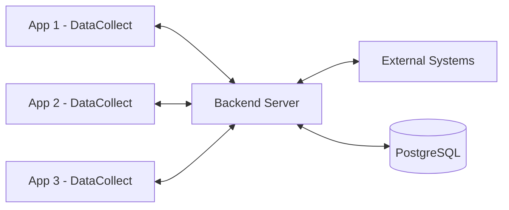

# ID PASS DataCollect

[](LICENSE)
[](https://www.typescriptlang.org/)
[](https://nodejs.org/)

> A robust offline-first data management system for household and beneficiary data with event sourcing and synchronization capabilities

## 🚀 Features

- **🔌 Offline-First Architecture** - Works seamlessly without internet using IndexedDB
- **🔄 Two-Level Synchronization** - Client ↔ Server ↔ External system sync
- **📝 Event Sourcing** - Complete audit trail of all data changes
- **🏢 Multi-Tenant Support** - Single backend serving multiple applications
- **🔐 JWT Authentication** - Secure API access with role-based permissions
- **🎯 TypeScript Throughout** - Type-safe development experience
- **📊 Conflict Resolution** - Automatic handling of data conflicts during sync
- **🔧 Extensible Architecture** - Custom event types and sync adapters

## 📦 Project Structure

This monorepo contains four main packages:

- **`packages/datacollect`** - Core library for offline data management
- **`packages/backend`** - Central sync server with PostgreSQL
- **`packages/admin`** - Vue.js admin interface for server management
- **`packages/mobile`** - Mobile application built with Vue.js and Capacitor

## 🚀 Quick Start

For setting up on Docker, see the [docker/README](docker/README.md)

### Prerequisites

- Node.js 22.x or higher
- PostgreSQL 15+ (for backend)
- pnpm 10.x

### Installation

1. Clone the repository:

```bash
git clone https://github.com/idpass/idpass-data-collect.git
cd idpass-data-collect
```

2. Install dependencies:

```bash
# Install all workspace dependencies
pnpm install
```

3. Build the datacollect library (required before using in other packages):

```bash
pnpm build:datacollect
```

4. Set up environment variables:

```bash
cp .env.example .env
# Edit .env with your configuration
```

5. Start the development servers:

```bash
# Terminal 1: Backend server
pnpm dev:backend

# Terminal 2: Admin interface
pnpm dev:admin
```

## 📖 Documentation

- [Getting Started Guide](./website/docs/index.md)
- [Architecture Overview](./website/docs/architecture/index.md)
- [API Reference](./website/docs/api/datacollect/README.md)
- [Deployment Guide](./website/docs/deployment/docker-deployment.md)
- [Examples](examples/)
- [Glossary](./website/docs/glossary.md)

## 💻 Basic Usage

```typescript
import { EntityDataManager } from "@idpass/data-collect-core";

// Initialize the data manager
const manager = new EntityDataManager(/* ... */);

// Create a household group
const household = await manager.submitForm({
  type: "create-group",
  data: { name: "Smith Family" },
  // ... other fields
});

// Add members to household
const updated = await manager.submitForm({
  type: "add-member",
  entityGuid: household.guid,
  data: {
    members: [{ name: "John Smith", dateOfBirth: "1980-01-15" }],
  },
  // ... other fields
});
```

See [examples/basic-usage](./website/docs/examples/basic-usage/) for a complete example.

## 🏗️ Architecture


```mermaid
graph LR
    A1[App 1 - DataCollect]<--> B[Backend Server]
    A2[App 2 - DataCollect] <--> B
    A3[App 3 - DataCollect] <--> B
    B <--> C[External Systems]
    B <--> D[(PostgreSQL)]
```

The system uses event sourcing with CQRS pattern:

- **Events** represent immutable changes to entities
- **Entities** represent current state (Groups and Individuals)
- **Sync** handles bidirectional data synchronization
- **Storage Adapters** abstract database operations

## 🧪 Testing

```bash
# Run all tests
pnpm test

# Run tests for specific package
pnpm test:datacollect
pnpm test:backend
pnpm test:admin

# Run with coverage (package-specific)
cd packages/datacollect && pnpm test -- --coverage
```

## 🤝 Contributing

We welcome contributions! Please see our [Contributing Guide](CONTRIBUTING.md) for details on:

- Code of Conduct
- Development setup
- Submitting pull requests
- Coding standards

## 📄 License

This project is licensed under the Apache License 2.0 - see the [LICENSE](LICENSE) file for details.

## 🔗 Links

- [GitHub Repository](https://github.com/idpass/idpass-data-collect)
- [Issue Tracker](https://github.com/idpass/idpass-data-collect/issues)
- [Website](https://acn.fr)

## 👥 Authors

Developed and maintained by [Association pour la Coopération Numérique](https://acn.fr)

---

For questions or support, please [open an issue](.github/ISSUE_TEMPLATE) or contact the maintainers.
