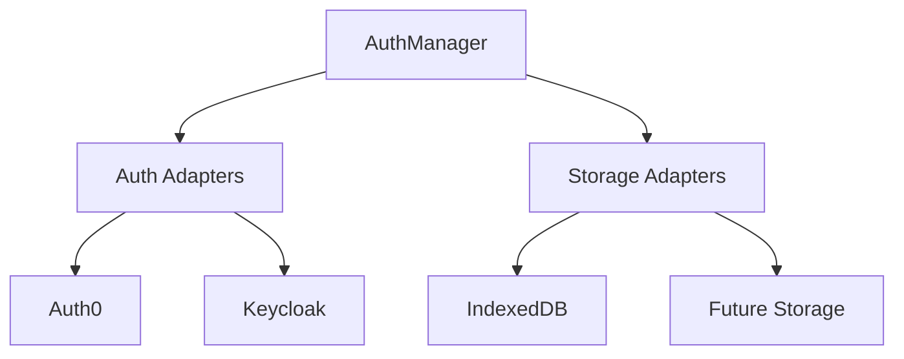
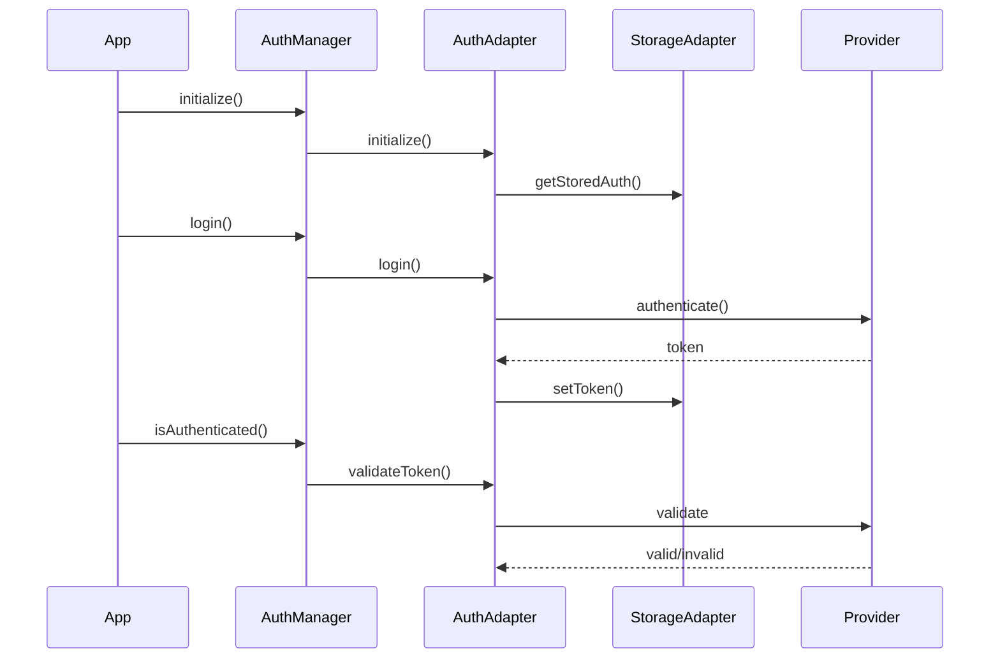
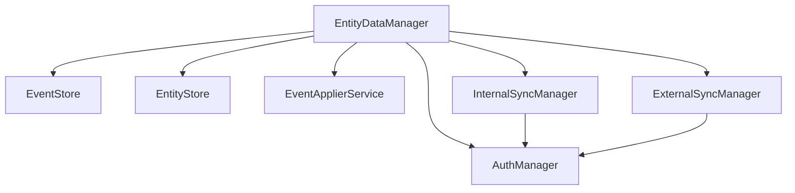

# Authentication Architecture

The ID PASS Data Collect authentication system provides a flexible, secure, and extensible authentication framework that supports multiple authentication providers and secure token storage.

## Overview

The authentication architecture consists of three main components:

1. **AuthManager**: Central authentication coordinator
2. **Auth Adapters**: Provider-specific implementations (Auth0, Keycloak)
3. **Storage Adapters**: Token persistence layer



## Core Components

### AuthManager

The `AuthManager` class serves as the central coordinator for authentication operations:

- Manages multiple authentication providers
- Coordinates token storage and retrieval
- Handles authentication state
- Provides unified authentication interface

### Auth Adapters

Provider-specific adapters implement the `AuthAdapter` interface:

- **Auth0Adapter**: Auth0-specific implementation
- **KeycloakAdapter**: Keycloak-specific implementation
- Future adapters can be added by implementing the interface

### Storage Adapters

Storage adapters implement the `AuthStorageAdapter` interface:

- **IndexedDbAuthStorageAdapter**: Browser-based storage
- Extensible for different storage backends
- Multi-tenant support

## Authentication Flow



## Token Management

### Storage

- Tokens are stored securely using the configured storage adapter
- Multi-tenant support through tenant-specific storage instances
- Automatic token cleanup on logout

### Validation

- Provider-specific token validation
- Environment-aware validation (frontend/backend)
- Regular token validation checks

## Security Features

1. **Token Security**
   - Secure token storage
   - Token validation on each use
   - Automatic token cleanup

2. **Provider Integration**
   - OAuth 2.0 and OpenID Connect support
   - Provider-specific security features
   - Organization/Realm-based access control

3. **Multi-tenant Security**
   - Tenant isolation
   - Separate storage per tenant
   - Tenant-specific configurations

## Configuration

### Auth0 Configuration

```typescript
const auth0Config = {
  type: "auth0",
  fields: {
    authority: "https://example.auth0.com",
    client_id: "CLIENT_ID",
    organization: "ORG_ID"
  }
};
```

### Keycloak Configuration

```typescript
const keycloakConfig = {
  type: "keycloak",
  fields: {
    authority: "https://keycloak.example.com",
    client_id: "CLIENT_ID",
    realm: "REALM_NAME"
  }
};
```

## Extension Points

The authentication system can be extended in several ways:

1. **New Auth Providers**
   - Implement `AuthAdapter` interface
   - Add provider-specific configuration
   - Register with `AuthManager`

2. **Storage Backends**
   - Implement `AuthStorageAdapter` interface
   - Add storage-specific configuration
   - Use with existing auth adapters

3. **Custom Validation**
   - Override validation methods
   - Add custom validation rules
   - Implement provider-specific checks

## Best Practices

1. **Security**
   - Use HTTPS in production
   - Implement token rotation
   - Regular token validation
   - Secure storage configuration

2. **Configuration**
   - Environment-specific settings
   - Proper error handling
   - Logging and monitoring

3. **Integration**
   - Single authentication instance
   - Proper initialization order
   - Clean logout handling

## Error Handling

The system provides comprehensive error handling:

```typescript
try {
  await authManager.login(credentials);
} catch (error) {
  if (error instanceof AuthenticationError) {
    // Handle authentication errors
  } else if (error instanceof StorageError) {
    // Handle storage errors
  } else {
    // Handle unexpected errors
  }
}
```

## Future Considerations

1. **Additional Providers**
   - Microsoft Azure AD
   - Google Identity Platform
   - Custom OAuth providers

2. **Enhanced Security**
   - Biometric authentication
   - Multi-factor authentication
   - Hardware security keys

3. **Storage Options**
   - Encrypted storage
   - Cross-device sync
   - Offline support

## Integration with EntityManager

The `EntityDataManager` integrates with `AuthManager` to provide authenticated data operations and synchronization capabilities:



### Initialization

```typescript
const authManager = new AuthManager(
  [{ 
    type: "mock-auth-adapter", 
    fields: { url: "http://localhost:3000" } 
  }],
  "http://localhost:3000",
  authStorage
);

const entityManager = new EntityDataManager(
  eventStore,
  entityStore,
  eventApplierService,
  externalSyncManager,
  internalSyncManager,
  authManager
);
```

### Authentication Flow

```typescript
// Login
await entityManager.login({ 
  username: "admin@example.com", 
  password: "password123" 
});

// Check for unsynced events
const hasUnsynced = await entityManager.hasUnsyncedEvents();
if (hasUnsynced) {
  // Sync requires authentication
  await entityManager.syncWithSyncServer();
}

// Logout
await entityManager.logout();
```

### Sync Operations

```typescript
try {
  // Submit form data
  const formData: FormSubmission = {
    guid: uuidv4(),
    entityGuid: groupId,
    type: "create-group",
    data: { name: "Test Group" },
    timestamp: new Date().toISOString(),
    userId: "user-1",
    syncLevel: SyncLevel.LOCAL
  };

  await entityManager.submitForm(formData);

  // Check sync status
  const unsyncedCount = await entityManager.getUnsyncedEventsCount();
  if (unsyncedCount > 0) {
    await entityManager.syncWithSyncServer();
  }
} catch (error) {
  if (error.message === "Unauthorized") {
    // Handle authentication errors
    await entityManager.login(credentials);
  }
}
```

### Error Handling

```typescript
try {
  await entityManager.syncWithSyncServer();
} catch (error) {
  switch (error.message) {
    case "Unauthorized":
      // Handle authentication errors
      await entityManager.login(credentials);
      break;
    case "Network Error":
      // Handle connectivity issues
      console.error("Sync server unreachable");
      break;
    default:
      // Handle other sync errors
      console.error("Sync failed:", error);
  }
}
```

### Sync Levels

The system supports different sync levels:

```typescript
enum SyncLevel {
  LOCAL = 0,    // Local changes only
  INTERNAL = 1, // Sync with internal server
  EXTERNAL = 2  // Sync with external server
}

// Example usage
const formData: FormSubmission = {
  // ... other fields ...
  syncLevel: SyncLevel.INTERNAL
};
```

### Best Practices

1. **Authentication Management**
   - Handle authentication before sync operations
   - Implement proper token refresh
   - Clear authentication on logout

2. **Sync Strategy**
   - Check for unsynced events regularly
   - Handle sync conflicts appropriately
   - Implement retry mechanisms

3. **Error Handling**
   - Handle authentication errors gracefully
   - Provide clear error messages
   - Implement proper fallback mechanisms

4. **Performance**
   - Batch sync operations when possible
   - Monitor unsynced events count
   - Implement proper caching

### Testing Considerations

```typescript
describe("EntityManager Authentication", () => {
  it("should handle sync with authentication", async () => {
    // Setup
    const entityManager = new EntityDataManager(
      eventStore,
      entityStore,
      eventApplierService,
      externalSyncManager,
      internalSyncManager,
      authManager
    );

    // Login
    await entityManager.login({
      username: "admin@example.com",
      password: "password123"
    });

    // Submit and sync data
    await entityManager.submitForm(formData);
    expect(await entityManager.hasUnsyncedEvents()).toBe(true);
    await entityManager.syncWithSyncServer();
    expect(await entityManager.hasUnsyncedEvents()).toBe(false);

    // Cleanup
    await entityManager.logout();
  });
});
```

