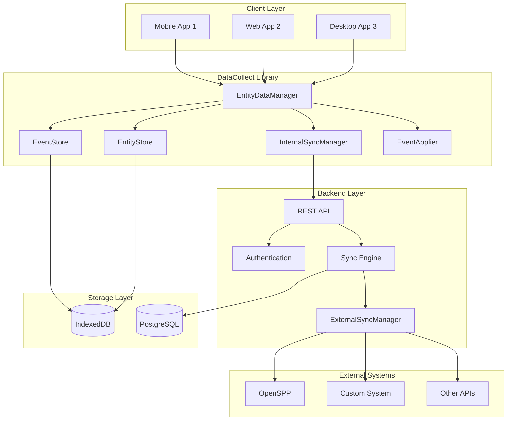
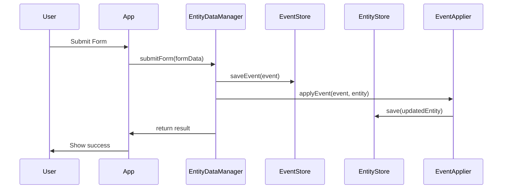
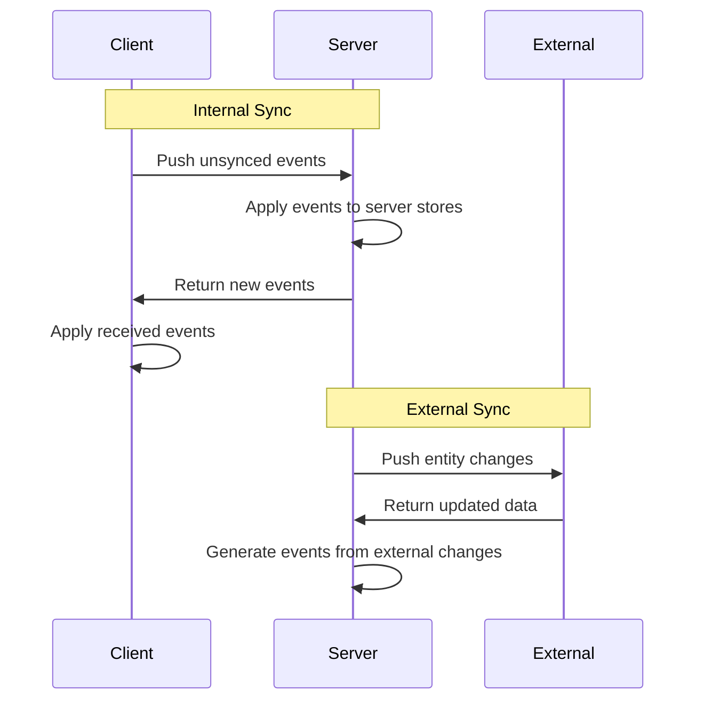

# Architecture Overview

ID PASS Data Collect implements a sophisticated offline-first data management architecture using event sourcing and CQRS patterns. This document provides a high-level overview of the system architecture.

## System Overview



## Core Architectural Principles

### 1. Offline-First Design

The system is designed to function completely offline, with synchronization as an enhancement rather than a requirement:

- **Local-first data**: All operations work without network connectivity
- **Eventual consistency**: Data synchronizes when connectivity is available
- **Conflict resolution**: Automatic handling of data conflicts during sync

### 2. Event Sourcing

All data changes are stored as immutable events, providing:

- **Complete audit trail**: Every change is tracked with timestamp and user
- **Time travel**: Ability to recreate state at any point in time
- **Replay capability**: Events can be replayed to rebuild entity state

### 3. CQRS (Command Query Responsibility Segregation)

Separate models for reading and writing data:

- **Commands**: FormSubmissions that generate events
- **Queries**: Read optimized entity views
- **Event application**: Transforms events into current entity state

### 4. Multi-Level Synchronization

Two distinct synchronization levels:

- **Internal Sync**: Between client instances and central server
- **External Sync**: Between central server and external systems

## Core Components

### EntityDataManager

Central orchestrator that coordinates all data operations:

```typescript
class EntityDataManager {
  constructor(
    private eventStore: EventStore,
    private entityStore: EntityStore, 
    private syncAdapter: SyncAdapter,
    private internalSyncManager: InternalSyncManager,
    private eventApplierService: EventApplierService
  )
}
```

**Responsibilities:**
- Process form submissions into events
- Coordinate between stores and sync managers
- Handle data validation and business rules

### EventStore

Immutable storage of all data change events:

```typescript
interface EventStore {
  saveEvent(event: Event): Promise<void>
  getEvents(filters: EventFilters): Promise<Event[]>
  getUnsynced(): Promise<Event[]>
  markSynced(eventIds: string[]): Promise<void>
}
```

**Key Features:**
- Append-only storage pattern
- Efficient querying by entity, user, time range
- Sync status tracking

### EntityStore

Current state storage optimized for querying:

```typescript
interface EntityStore {
  save(entity: EntityDoc): Promise<void>
  get(id: string): Promise<EntityDoc | null>
  query(filters: EntityFilters): Promise<EntityDoc[]>
  delete(id: string): Promise<void>
}
```

**Key Features:**
- Fast read access to current entity state
- Support for complex queries and filtering
- Materialized views of event-sourced data

### InternalSyncManager

Handles synchronization between client and server:

```typescript
class InternalSyncManager {
  async pushEvents(): Promise<SyncResult>
  async pullEvents(): Promise<SyncResult>  
  async fullSync(): Promise<SyncResult>
}
```

**Sync Process:**
1. **Push Phase**: Send local unsynced events to server
2. **Pull Phase**: Receive new events from server
3. **Apply Phase**: Apply received events to local stores

### ExternalSyncManager (Server-side)

Manages synchronization with external systems:

```typescript
class ExternalSyncManager {
  async syncWithExternal(config: ExternalConfig): Promise<void>
  registerAdapter(type: string, adapter: ExternalSyncAdapter): void
}
```

**Adapter Pattern:**
- Pluggable adapters for different external systems
- Standardized interface for data transformation
- Configurable authentication strategies

## Data Flow

### 1. Data Input Flow



### 2. Synchronization Flow



## Storage Adapters

### Client-Side Storage (IndexedDB)

```typescript
class IndexedDbEventStorageAdapter implements EventStorageAdapter {
  // Optimized for offline access
  // Handles large datasets efficiently
  // Supports complex queries
}

class IndexedDbEntityStorageAdapter implements EntityStorageAdapter {
  // Fast entity retrieval
  // Indexed searching and filtering
  // Efficient updates and deletes
}
```

### Server-Side Storage (PostgreSQL)

```typescript
class PostgresEventStorageAdapter implements EventStorageAdapter {
  // ACID compliance for data integrity
  // Advanced querying capabilities
  // Horizontal scaling support
}

class PostgresEntityStorageAdapter implements EntityStorageAdapter {
  // Relational data modeling
  // Full-text search capabilities
  // Backup and recovery features
}
```

## Security Architecture

### Authentication & Authorization

- **JWT-based authentication** for API access
- **Role-based access control** (admin, user roles)
- **Multi-tenant isolation** at data and API level

### Data Protection

- **Encryption in transit** using HTTPS/TLS
- **Encryption at rest** for sensitive data fields
- **Audit logging** for all data access and changes

### Privacy Features

- **Data minimization** - collect only necessary data
- **Retention policies** - automatic data cleanup
- **Export capabilities** - user data portability
- **Anonymization tools** - remove personally identifiable information

## Scalability Considerations

### Horizontal Scaling

- **Stateless API design** enables load balancing
- **Database sharding** by tenant or region
- **Microservices decomposition** for high-scale deployments

### Performance Optimization

- **Pagination** for large datasets (10 records/page default)
- **Caching strategies** for frequently accessed data
- **Background processing** for heavy sync operations
- **Lazy loading** for improved startup performance

## Technology Stack

### Client Libraries
- **TypeScript** - Type-safe development
- **IndexedDB** - Client-side storage
- **Modern web APIs** - Offline, storage, networking

### Backend Services
- **Node.js** - JavaScript runtime
- **Express.js** - Web framework
- **PostgreSQL** - Primary database
- **JSON Web Tokens** - Authentication

### Development Tools
- **Jest** - Testing framework
- **ESLint** - Code linting
- **Prettier** - Code formatting
- **GitHub Actions** - CI/CD pipeline

## Next Steps

- [Event Sourcing Details](event-sourcing.md)
- [Synchronization Architecture](sync-architecture.md)
- [Storage Adapter Patterns](storage-adapters.md)
- [Security Model](security-model.md)
- [Data Flow Diagrams](data-flow.md)