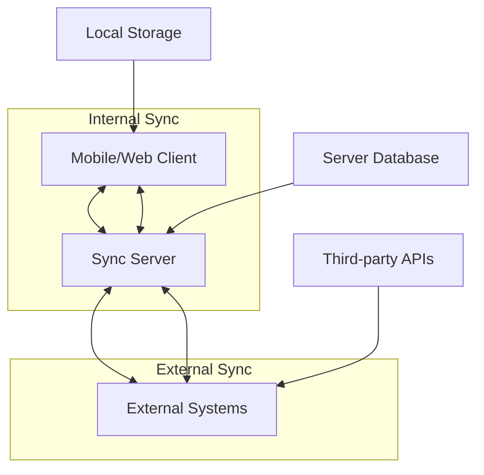

# Synchronization Architecture

ID PASS DataCollect implements a sophisticated multi-level synchronization architecture that enables offline-first operation while maintaining data consistency across distributed systems. This document details the sync patterns, conflict resolution strategies, and implementation specifics.

## Overview

The synchronization architecture supports three levels of data synchronization:



## Sync Levels

### 1. Local Level (Offline)

Data exists only on the client device:

```typescript
enum SyncLevel {
  LOCAL = 'LOCAL',      // Not synced
  SYNCED = 'SYNCED',    // Synced with server
  EXTERNAL = 'EXTERNAL' // Synced with external system
}
```

### 2. Internal Sync (Client ↔ Server)

Bidirectional sync between clients and the DataCollect server:

```typescript
class InternalSyncManager {
  constructor(
    private eventStore: EventStore,
    private entityStore: EntityStore,
    private eventApplierService: EventApplierService,
    private serverUrl: string,
    private authToken: string
  ) {}

  async sync(): Promise<void> {
    await this.push(); // Send local changes
    await this.pull(); // Receive remote changes
  }
}
```

### 3. External Sync (Server ↔ Third-party)

Integration with external systems like OpenSPP:

```typescript
class ExternalSyncManager {
  constructor(
    private eventStore: EventStore,
    private eventApplierService: EventApplierService,
    private config: ExternalSyncConfig
  ) {}

  async synchronize(credentials?: ExternalSyncCredentials): Promise<void> {
    await this.pushToExternal();
    await this.pullFromExternal();
  }
}
```

## Internal Sync Architecture

### Push Synchronization

Sending local changes to the server:

```typescript
async function pushSync(): Promise<void> {
  // 1. Get unsynced events
  const unsyncedEvents = await eventStore.getEventsSince(lastSyncTimestamp);
  
  // 2. Batch events for efficiency
  const batches = chunkArray(unsyncedEvents, BATCH_SIZE);
  
  // 3. Send each batch
  for (const batch of batches) {
    try {
      const response = await syncAdapter.push({
        events: batch,
        clientId: getClientId(),
        timestamp: new Date().toISOString()
      });
      
      // 4. Mark events as synced
      for (const event of batch) {
        await eventStore.updateEventSyncLevel(event.guid, SyncLevel.SYNCED);
      }
      
      // 5. Handle conflicts
      if (response.conflicts.length > 0) {
        await handleConflicts(response.conflicts);
      }
    } catch (error) {
      // Handle sync failures
      await handleSyncError(error, batch);
    }
  }
  
  // 6. Update sync timestamp
  await eventStore.setLastRemoteSyncTimestamp(new Date().toISOString());
}
```

### Pull Synchronization

Receiving changes from the server:

```typescript
async function pullSync(): Promise<void> {
  let hasMore = true;
  let cursor = await eventStore.getLastRemoteSyncTimestamp();
  
  while (hasMore) {
    // 1. Request changes from server
    const response = await syncAdapter.pull({
      since: cursor,
      limit: PAGE_SIZE,
      clientId: getClientId()
    });
    
    // 2. Process received events
    for (const event of response.events) {
      // Check if we already have this event
      if (!await eventStore.isEventExisted(event.guid)) {
        // Apply event to local state
        await eventApplierService.submitForm({
          ...event,
          syncLevel: SyncLevel.SYNCED
        });
      }
    }
    
    // 3. Process received audit logs
    if (response.auditLogs?.length > 0) {
      await eventStore.saveAuditLogs(response.auditLogs);
    }
    
    // 4. Update cursor for pagination
    cursor = response.nextCursor;
    hasMore = response.hasMore;
  }
  
  // 5. Update sync timestamp
  await eventStore.setLastRemoteSyncTimestamp(new Date().toISOString());
}
```

### Conflict Resolution

ID PASS DataCollect implements several conflict resolution strategies:

#### 1. Version-Based Resolution

```typescript
interface VersionedEntity {
  guid: string;
  version: number;
  lastUpdated: string;
  data: any;
}

async function resolveVersionConflict(
  local: VersionedEntity,
  remote: VersionedEntity
): Promise<VersionedEntity> {
  // Last-write-wins strategy
  if (local.lastUpdated > remote.lastUpdated) {
    return local;
  } else if (remote.lastUpdated > local.lastUpdated) {
    return remote;
  } else {
    // Same timestamp - use version number
    return local.version > remote.version ? local : remote;
  }
}
```

#### 2. Field-Level Merge

```typescript
async function mergeConflicts(
  local: EntityDoc,
  remote: EntityDoc
): Promise<EntityDoc> {
  const merged = {
    ...local,
    data: {}
  };
  
  // Merge non-conflicting fields
  const allFields = new Set([
    ...Object.keys(local.data),
    ...Object.keys(remote.data)
  ]);
  
  for (const field of allFields) {
    const localValue = local.data[field];
    const remoteValue = remote.data[field];
    
    if (localValue === remoteValue) {
      // No conflict
      merged.data[field] = localValue;
    } else if (localValue && !remoteValue) {
      // Local has value, remote doesn't
      merged.data[field] = localValue;
    } else if (!localValue && remoteValue) {
      // Remote has value, local doesn't
      merged.data[field] = remoteValue;
    } else {
      // Both have different values - apply resolution strategy
      merged.data[field] = await resolveFieldConflict(
        field,
        localValue,
        remoteValue,
        local.lastUpdated,
        remote.lastUpdated
      );
    }
  }
  
  return merged;
}
```

#### 3. User-Driven Resolution

```typescript
interface ConflictResolution {
  strategy: 'local' | 'remote' | 'manual';
  resolver?: (local: any, remote: any) => Promise<any>;
}

async function presentConflictToUser(
  conflict: SyncConflict
): Promise<ConflictResolution> {
  // Show conflict UI
  const resolution = await showConflictDialog({
    localValue: conflict.local,
    remoteValue: conflict.remote,
    field: conflict.field,
    entityName: conflict.entityName
  });
  
  return resolution;
}
```

## External Sync Architecture

### Sync Adapter Pattern

External sync uses pluggable adapters for different systems:

```typescript
interface ExternalSyncAdapter {
  initialize(): Promise<void>;
  authenticate(credentials: ExternalSyncCredentials): Promise<void>;
  push(entities: EntityDoc[]): Promise<PushResult>;
  pull(since: string): Promise<PullResult>;
  mapToExternal(entity: EntityDoc): Promise<any>;
  mapFromExternal(externalData: any): Promise<EntityDoc>;
}
```

### OpenSPP Adapter Implementation

```typescript
class OpenSppSyncAdapter implements ExternalSyncAdapter {
  private client: OpenSppClient;
  
  async push(entities: EntityDoc[]): Promise<PushResult> {
    const results = {
      succeeded: [],
      failed: [],
      conflicts: []
    };
    
    for (const entity of entities) {
      try {
        // Map to OpenSPP format
        const opensppData = await this.mapToExternal(entity);
        
        // Send to OpenSPP
        const response = await this.client.upsertBeneficiary(opensppData);
        
        // Update external ID
        entity.externalId = response.id;
        results.succeeded.push(entity);
        
      } catch (error) {
        if (error.code === 'CONFLICT') {
          results.conflicts.push({
            entity,
            error: error.message,
            remoteData: error.remoteData
          });
        } else {
          results.failed.push({ entity, error });
        }
      }
    }
    
    return results;
  }
  
  async mapToExternal(entity: EntityDoc): Promise<any> {
    // Transform DataCollect format to OpenSPP format
    return {
      partner_name: entity.data.name,
      birth_date: entity.data.birthDate,
      mobile_phone: entity.data.contactNumber,
      street_address: entity.data.address?.street,
      city: entity.data.address?.city,
      state_id: entity.data.address?.province,
      // Custom field mapping
      x_datacollect_guid: entity.guid,
      x_datacollect_version: entity.version
    };
  }
}
```

## Sync Performance Optimization

### 1. Incremental Sync

Only sync changes since last successful sync:

```typescript
class IncrementalSync {
  async getChangedEntities(since: string): Promise<EntityDoc[]> {
    // Use indexed timestamp for fast queries
    const modifiedEntities = await entityStore.getModifiedEntitiesSince(since);
    
    // Filter out already-synced entities
    return modifiedEntities.filter(entity => 
      entity.modified.syncLevel === SyncLevel.LOCAL
    );
  }
}
```

### 2. Batch Processing

Process entities in optimized batches:

```typescript
const OPTIMAL_BATCH_SIZE = 100;

async function batchSync(entities: EntityDoc[]): Promise<void> {
  const batches = [];
  
  for (let i = 0; i < entities.length; i += OPTIMAL_BATCH_SIZE) {
    batches.push(entities.slice(i, i + OPTIMAL_BATCH_SIZE));
  }
  
  // Process batches in parallel with concurrency limit
  await pLimit(5)(
    batches.map(batch => () => processBatch(batch))
  );
}
```

### 3. Delta Sync

Only send changed fields:

```typescript
interface DeltaSync {
  entityGuid: string;
  changes: {
    field: string;
    oldValue: any;
    newValue: any;
  }[];
  version: number;
  timestamp: string;
}

function calculateDelta(
  previous: EntityDoc,
  current: EntityDoc
): DeltaSync {
  const changes = [];
  
  for (const key in current.data) {
    if (previous.data[key] !== current.data[key]) {
      changes.push({
        field: key,
        oldValue: previous.data[key],
        newValue: current.data[key]
      });
    }
  }
  
  return {
    entityGuid: current.guid,
    changes,
    version: current.version,
    timestamp: current.lastUpdated
  };
}
```

## Sync State Management

### Sync Status Tracking

```typescript
interface SyncStatus {
  lastSyncTime: string;
  syncInProgress: boolean;
  pendingEvents: number;
  failedEvents: number;
  conflicts: number;
  nextRetry?: string;
}

class SyncStatusManager {
  private status: SyncStatus = {
    lastSyncTime: null,
    syncInProgress: false,
    pendingEvents: 0,
    failedEvents: 0,
    conflicts: 0
  };
  
  async updateStatus(updates: Partial<SyncStatus>): Promise<void> {
    this.status = { ...this.status, ...updates };
    await this.persistStatus();
    this.notifyListeners();
  }
}
```

### Retry Mechanism

Implement exponential backoff for failed syncs:

```typescript
class SyncRetryManager {
  private retryCount = 0;
  private baseDelay = 1000; // 1 second
  private maxDelay = 300000; // 5 minutes
  
  async retrySync(): Promise<void> {
    const delay = Math.min(
      this.baseDelay * Math.pow(2, this.retryCount),
      this.maxDelay
    );
    
    await sleep(delay);
    
    try {
      await this.performSync();
      this.retryCount = 0; // Reset on success
    } catch (error) {
      this.retryCount++;
      
      if (this.shouldRetry(error)) {
        await this.retrySync(); // Recursive retry
      } else {
        throw error; // Give up
      }
    }
  }
  
  private shouldRetry(error: any): boolean {
    // Don't retry on authentication errors
    if (error.code === 401) return false;
    
    // Don't retry after too many attempts
    if (this.retryCount >= 10) return false;
    
    // Retry on network errors
    return error.code === 'NETWORK_ERROR';
  }
}
```

## Security in Sync

### 1. Authentication

JWT-based authentication for sync operations:

```typescript
class SecureSyncAdapter {
  private token: string;
  
  async authenticate(email: string, password: string): Promise<void> {
    const response = await fetch(`${this.serverUrl}/auth/login`, {
      method: 'POST',
      body: JSON.stringify({ email, password })
    });
    
    const { token } = await response.json();
    this.token = token;
  }
  
  private getAuthHeaders(): Headers {
    return {
      'Authorization': `Bearer ${this.token}`,
      'X-Client-ID': this.clientId,
      'X-Sync-Version': SYNC_PROTOCOL_VERSION
    };
  }
}
```

### 2. Data Encryption

Encrypt sensitive data during sync:

```typescript
class EncryptedSync {
  async encryptForSync(data: any): Promise<string> {
    const key = await this.deriveKey();
    const iv = crypto.getRandomValues(new Uint8Array(16));
    
    const encrypted = await crypto.subtle.encrypt(
      {
        name: 'AES-GCM',
        iv
      },
      key,
      new TextEncoder().encode(JSON.stringify(data))
    );
    
    return btoa(String.fromCharCode(...new Uint8Array(encrypted)));
  }
}
```

### 3. Audit Logging

Log all sync operations for security:

```typescript
async function auditSyncOperation(operation: SyncOperation): Promise<void> {
  await auditLog.write({
    timestamp: new Date().toISOString(),
    operation: operation.type,
    user: operation.userId,
    device: operation.deviceId,
    entitiesAffected: operation.entityCount,
    duration: operation.duration,
    status: operation.status,
    errors: operation.errors
  });
}
```

## Monitoring and Debugging

### Sync Metrics

Track key metrics for monitoring:

```typescript
interface SyncMetrics {
  syncDuration: number;
  entitiesSynced: number;
  bytesTransferred: number;
  conflictsResolved: number;
  errorsEncountered: number;
  retryAttempts: number;
}

class SyncMonitor {
  async recordMetrics(metrics: SyncMetrics): Promise<void> {
    // Send to monitoring service
    await telemetry.send('sync.completed', metrics);
    
    // Alert on anomalies
    if (metrics.errorsEncountered > 10) {
      await alerting.send('High sync error rate detected');
    }
  }
}
```

### Sync Debugging Tools

```typescript
// Sync inspector
async function inspectSyncState(): Promise<void> {
  console.log('=== Sync State Inspector ===');
  
  const unsyncedEvents = await eventStore.getUnsyncedEvents();
  console.log(`Unsynced events: ${unsyncedEvents.length}`);
  
  const lastSync = await eventStore.getLastRemoteSyncTimestamp();
  console.log(`Last sync: ${lastSync}`);
  
  const conflicts = await conflictStore.getUnresolvedConflicts();
  console.log(`Unresolved conflicts: ${conflicts.length}`);
  
  const failedSync = await syncQueue.getFailedItems();
  console.log(`Failed sync items: ${failedSync.length}`);
}

// Sync simulator
async function simulateSync(dryRun: boolean = true): Promise<void> {
  console.log(`Starting sync simulation (dry run: ${dryRun})`);
  
  const syncPlan = await planSync();
  console.log(`Will sync ${syncPlan.push.length} to server`);
  console.log(`Will receive ${syncPlan.pull.length} from server`);
  
  if (!dryRun) {
    await executeSync(syncPlan);
  }
}
```

## Best Practices

### 1. Offline-First Design

Always assume network is unavailable:

```typescript
async function saveWithSync(entity: EntityDoc): Promise<void> {
  // 1. Save locally first
  await entityStore.saveEntity(entity);
  
  // 2. Queue for sync
  await syncQueue.add(entity);
  
  // 3. Attempt sync if online
  if (await isOnline()) {
    try {
      await syncManager.syncEntity(entity);
    } catch (error) {
      // Sync failed - will retry later
      console.log('Sync failed, will retry when online');
    }
  }
}
```

### 2. Conflict Prevention

Design to minimize conflicts:

```typescript
// Use compound keys to prevent duplicates
const entityKey = `${entity.type}-${entity.data.nationalId}`;

// Use semantic versioning
const version = {
  major: 1, // Breaking changes
  minor: 2, // New fields
  patch: 3  // Bug fixes
};

// Partition data to reduce conflicts
const partition = hashEntity(entity) % NUM_PARTITIONS;
```

### 3. Sync Optimization

```typescript
// Compress data for sync
const compressed = await compress(JSON.stringify(entities));

// Use HTTP/2 for multiplexing
const http2Session = http2.connect(serverUrl);

// Implement smart polling
const pollInterval = calculateBackoff(failureCount);
```

## Conclusion

The synchronization architecture in ID PASS DataCollect provides:

- **Reliability**: Offline-first with automatic retry
- **Consistency**: Conflict resolution and version management
- **Performance**: Incremental and batch sync
- **Security**: Encrypted transport with audit logging
- **Flexibility**: Pluggable adapters for external systems

This architecture ensures data integrity across distributed deployments while maintaining excellent user experience in challenging network environments.