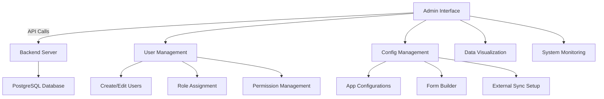
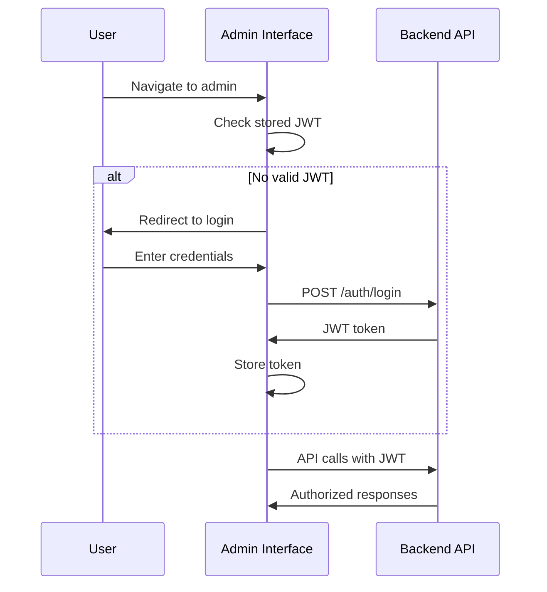

# Admin Package

The Admin package provides a Vue.js-based web interface for managing ID PASS DataCollect deployments, including user management, configuration, and data visualization.

## Overview

Built with Vue 3, TypeScript, and modern web technologies, the Admin interface offers a comprehensive management solution for:
- User account management
- Multi-tenant configuration
- Data visualization and analytics
- System monitoring and health checks

### Key Features

- 👥 **User Management**: Create, update, and manage user accounts and roles
- ⚙️ **Configuration Management**: Multi-tenant app configuration with form builders
- 📊 **Data Visualization**: View and analyze collected data with charts and tables
- 🎨 **Customizable Interface**: Theming and branding options
- 📱 **Responsive Design**: Works on desktop, tablet, and mobile devices
- 🔐 **Secure Access**: Role-based access control with JWT authentication

## Architecture



## Core Features

### User Management
Complete user administration capabilities:
- **User Creation**: Add new users with role assignment
- **Role Management**: Admin and user roles with different permissions
- **Account Status**: Enable/disable user accounts
- **Password Management**: Password reset and security policies

### Configuration Management
Multi-tenant configuration interface:
- **App Configurations**: Manage tenant-specific settings
- **Form Builder**: Visual form creation with FormIO integration
- **Entity Definitions**: Define custom data structures
- **External Sync**: Configure integrations with external systems

### Data Visualization
Analytics and reporting dashboard:
- **Entity Overview**: Summary of groups and individuals
- **Sync Status**: Real-time synchronization monitoring
- **User Activity**: Track user actions and system usage
- **Data Export**: Export data in various formats

## Quick Start

### Installation

```bash
cd admin
npm install
```

### Development Setup

Create a `.env` file:

```env
VITE_API_URL=http://localhost:3000
```

### Development

```bash
npm run dev
```

The admin interface will be available at `http://localhost:5173`

### Production Build

```bash
npm run build
npm run preview  # Preview production build
```

## User Interface

### Dashboard
Main overview with key metrics:
- Total users and active sessions
- Sync status across all clients
- Recent activity and notifications
- System health indicators

### User Management
Comprehensive user administration:
- User list with search and filtering
- User creation and editing forms
- Role assignment interface
- Account status management

### Configuration Management
App configuration interface:
- Configuration list and selection
- Form builder for entity definitions
- External sync setup wizard
- Configuration validation and testing

### Data Viewer
Entity and data visualization:
- Interactive data tables
- Search and filtering capabilities
- Export functionality
- Data validation reports

## Authentication Flow



## Configuration

### Environment Variables

```env
# API Configuration
VITE_API_URL=http://localhost:3000

# Feature Flags
VITE_ENABLE_ANALYTICS=true
VITE_ENABLE_EXPORT=true

# Branding
VITE_APP_TITLE="ID PASS DataCollect Admin"
VITE_APP_LOGO_URL="/logo.svg"
```

### Build Configuration

Vite configuration supports:
- TypeScript compilation
- Vue 3 composition API
- CSS preprocessing
- Asset optimization
- Environment-specific builds

## Components

### Core Components

#### UserManager
Complete user management interface:
```vue
<template>
  <UserManager 
    :users="users" 
    @create-user="handleCreateUser"
    @edit-user="handleEditUser"
    @delete-user="handleDeleteUser"
  />
</template>
```

#### ConfigEditor
App configuration management:
```vue
<template>
  <ConfigEditor 
    :config="appConfig"
    @save="handleSaveConfig"
    @validate="handleValidateConfig"
  />
</template>
```

#### DataViewer
Entity data visualization:
```vue
<template>
  <DataViewer 
    :entities="entities"
    :filters="filters"
    @export="handleExport"
    @refresh="handleRefresh"
  />
</template>
```

### Shared Components
Reusable UI components:
- Form input components
- Data table with sorting/filtering
- Modal dialogs
- Loading states
- Error handling

## Theming and Customization

### CSS Variables
Customize the interface appearance:

```css
:root {
  --primary-color: #1976d2;
  --secondary-color: #424242;
  --accent-color: #82b1ff;
  --background-color: #fafafa;
  --surface-color: #ffffff;
  --text-primary: #212121;
  --text-secondary: #757575;
}
```

### Logo and Branding
- Custom logo support
- Configurable application title
- Favicon customization
- Color scheme theming

### Layout Options
- Sidebar navigation
- Top navigation bar
- Responsive breakpoints
- Dark/light mode support

## Testing

### Unit Tests
```bash
npm run test:unit
```

### Component Testing
```bash
npm run test:component
```

### End-to-End Tests
```bash
npm run test:e2e
```

## Deployment

### Static Hosting
Deploy built assets to:
- Nginx/Apache web servers
- CDN services (Cloudflare, AWS CloudFront)
- Static hosting platforms (Netlify, Vercel)

### Docker Deployment
```dockerfile
FROM nginx:alpine
COPY dist/ /usr/share/nginx/html/
COPY nginx.conf /etc/nginx/nginx.conf
```

### Environment-Specific Builds
```bash
# Development
npm run build:dev

# Staging
npm run build:staging

# Production
npm run build:prod
```

## Browser Support

- Chrome 88+
- Firefox 85+
- Safari 14+
- Edge 88+

## Accessibility

- WCAG 2.1 AA compliance
- Keyboard navigation
- Screen reader support
- High contrast mode
- Focus management

## Performance

- Code splitting by routes
- Lazy loading of components
- Image optimization
- Bundle size optimization
- Service worker for caching

## Next Steps

- 📖 [User Guide](./user-guide/) - How to use the admin interface
- 🎨 [Theming Guide](./theming.md) - Customize appearance
- 🧩 [Component Library](./components/) - Available UI components
- 🚀 [Deployment Guide](../backend/deployment/) - Production deployment