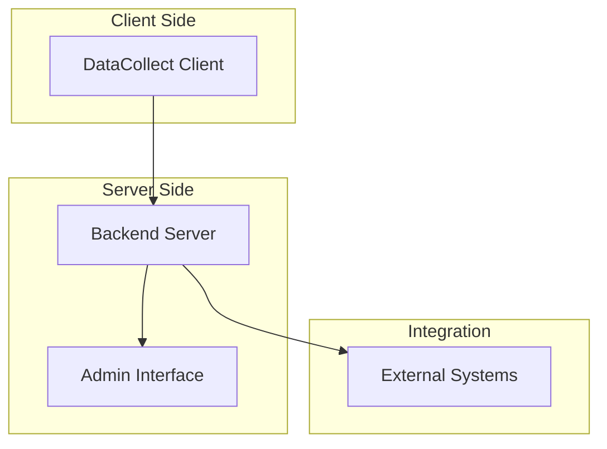

# ID PASS DataCollect Packages

ID PASS DataCollect is organized into three main packages, each serving a specific role in the offline-first data management ecosystem:

## 📦 Package Architecture

## Core Packages

### [DataCollect](./datacollect/)
**Client Library for Offline-First Data Management**

- 🗄️ **IndexedDB Storage**: Offline-capable data persistence
- 🔄 **Event Sourcing**: Complete audit trail and state reconstruction
- 📱 **Cross-Platform**: Works in browsers, mobile apps, and desktop applications
- 🔐 **Encryption Support**: Client-side data encryption capabilities

**Use Cases**: Mobile DataCollection, offline surveys, field data entry

---

### [Backend](./backend/)
**Central Sync Server & API**

- 🗃️ **PostgreSQL Storage**: Centralized, reliable data persistence
- 🔄 **Multi-Client Sync**: Synchronize data across multiple client instances
- 🔌 **External Integration**: Connect with third-party systems (OpenSPP, OpenFn)
- 👥 **Multi-Tenant**: Support for multiple organizations and configurations

**Use Cases**: Central data management, team collaboration, system integration

---

### [Admin](./admin/)
**Vue.js Administration Interface**

- 👥 **User Management**: Create and manage user accounts and permissions
- ⚙️ **Configuration**: Set up multi-tenant configurations and forms
- 📊 **Data Visualization**: View and analyze collected data
- 🎨 **Customizable**: Theming and branding options

**Use Cases**: Administrative oversight, user onboarding, data analysis

## Package Relationships

### Data Flow
1. **DataCollect** clients collect data offline using forms and event sourcing
2. **Backend** receives synchronized data from multiple clients
3. **Admin** interface provides management and visualization capabilities
4. **Backend** can sync with external systems for broader integration

### Development Workflow
1. Install and build DataCollect library first (required dependency)
2. Configure and run Backend server for multi-client scenarios
3. Set up Admin interface for user and configuration management

## Next Steps

- 📚 [Getting Started Guide](../getting-started/) - Installation and setup
- 🏗️ [Architecture Overview](../architecture/) - System design principles
- 🚀 [Integration Guides](../guides/integration/) - Cross-package development patterns