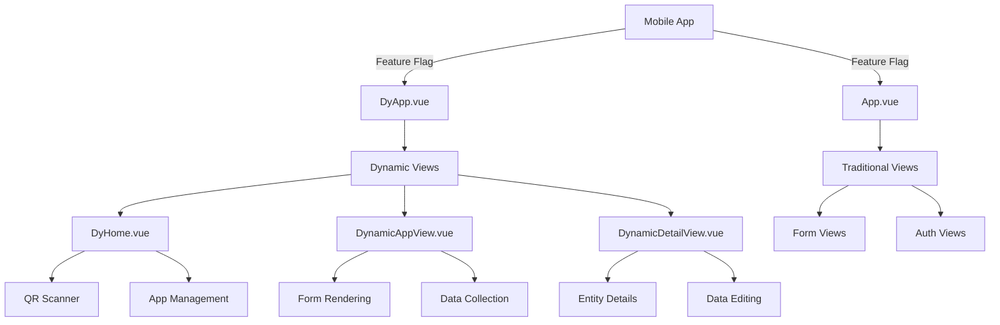

# Mobile Package

The Mobile package is an offline-first client application for ID PASS DataCollect that serves as a mobile data collection interface. It operates as a client instance that synchronizes with the DataCollect sync server when connectivity is available, enabling reliable data collection in environments with intermittent or no internet connectivity.

The Mobile package provides a Vue.js-based mobile application for ID PASS DataCollect, built with Capacitor for cross-platform mobile development. It supports both traditional form-based data collection and dynamic app configurations.

## Overview

Built with Vue 3, TypeScript, and Capacitor, the mobile application offers a flexible data collection solution for:
- Dynamic app configuration loading via QR codes or URLs
- Traditional form-based data collection
- Offline-first data storage with RxDB
- Cross-platform mobile deployment (iOS/Android)

### Key Features

- 📱 **Cross-Platform**: Native mobile apps for iOS and Android using Capacitor
- 🔄 **Dynamic App Loading**: Load app configurations via QR code scanning or URL input
- 📊 **Form Builder Integration**: Full FormIO integration for dynamic form creation
- 💾 **Offline Storage**: Local database with RxDB for offline data collection
- 🔐 **Secure Authentication**: JWT-based authentication with secure storage
- 🎨 **QR Code Scanning**: Built-in barcode scanning for app configuration loading
- 🎨 **Responsive Design**: Bootstrap-based UI with mobile-optimized components

## Architecture



## Core Features

### Dynamic App Configuration
The mobile app supports loading app configurations dynamically:
- **QR Code Scanning**: Scan QR codes to load app configurations
- **URL Input**: Manually enter app configuration URLs
- **Local Storage**: Store multiple app configurations locally
- **App Switching**: Switch between different app configurations

### Form-Based Data Collection
Traditional form-based data collection:
- **FormIO Integration**: Full FormIO form builder support
- **Dynamic Forms**: Render forms based on configuration
- **Data Validation**: Client-side and server-side validation
- **File Upload**: Support for image and document uploads

### Offline Capabilities
Offline-first data collection:
- **Local Database**: RxDB for local data storage
- **Sync Management**: Background synchronization when online
- **Conflict Resolution**: Handle data conflicts during sync

## Quick Start

### Installation

```bash
cd packages/mobile
npm install
```

### Development Setup

Create a `.env` file:

```env
VITE_DB_ENCRYPTION_PASSWORD=password
VITE_FEATURE_DYNAMIC=true
VITE_DEVELOP=true
```

### Development

```bash
npm run dev
```

The mobile app will be available at `http://localhost:8081`

### Mobile Development

```bash
# Build for iOS
npm run build:ios

# Build for Android
npm run build:android
```

## Application Structure

### Root Components

#### DyApp.vue
The dynamic app root component used when `VITE_FEATURE_DYNAMIC` is enabled:

```vue
<template>
  <header>
    <nav class="safe-top navbar p-3 d-flex justify-content-center border-bottom align-items-center">
      <h5 class="m-0 bold title text-black">ID PASS DataCollect</h5>
    </nav>
  </header>
  <main class="mx-2">
    <div class="user-select-none disable-scrollbars">
      <RouterView />
    </div>
  </main>
</template>
```

#### App.vue
The traditional app root component used when dynamic features are disabled:

```vue
<template>
  <div id="app" class="vh-100 h-100 overflow-scroll text-break">
    <header>
      <nav class="safe-top navbar p-3 d-flex justify-content-center border-bottom align-items-center">
        <h5 class="m-0 bold title text-black">ID PASS DataCollect</h5>
      </nav>
    </header>
    <main class="mx-2">
      <div class="user-select-none disable-scrollbars">
        <RouterView />
      </div>
    </main>
    <footer class="pb-safe"></footer>
  </div>
</template>
```

### Dynamic Views

#### DyHome.vue
The main dashboard for dynamic app management:

```vue
<template>
  <div class="d-flex flex-column gap-2">
    <h2 class="mb-4">Apps</h2>
    <!-- App list and management -->
    <ul role="list" class="list-group list-group-flush shadow-sm mt-2">
      <li v-for="app in tenantapps" :key="app.name" class="card border-0 rounded-0">
        <!-- App item -->
      </li>
    </ul>
    <!-- QR scanner button -->
  </div>
</template>
```

#### DynamicAppView.vue
Renders dynamic forms based on app configuration:

```vue
<template>
  <div class="dynamic-app">
    <!-- Form rendering based on configuration -->
    <Formio 
      :form="formConfig"
      :submission="submission"
      @submit="handleSubmit"
    />
  </div>
</template>
```

### Environment Variables

```env
# Feature Flags
VITE_DB_ENCRYPTION_PASSWORD=password
VITE_FEATURE_DYNAMIC=true
VITE_DEVELOP=true
```

### Capacitor Configuration

```typescript
const config: CapacitorConfig = {
  appId: "com.openspp.selfreg",
  appName: "ID PASS DataCollect",
  webDir: "dist",
  server: {
    cleartext: true,
  },
  android: {
    allowMixedContent: true,
  },
  plugins: {
    CapacitorHttp: {
      enabled: true
    }
  }
};
```

## Database Schema

### Tenant App Schema
```typescript
interface TenantAppData {
  id: string;
  name: string;
  description?: string;
  configuration: any;
  createdAt: Date;
  updatedAt: Date;
}
```

### Form Schema
```typescript
interface FormData {
  id: string;
  appId: string;
  formConfig: any;
  submissions: any[];
  createdAt: Date;
}
```

## Components

### Core Components

#### QrScanner
QR code scanning for app configuration loading:
```vue
<template>
  <QrScanner 
    @scan="handleScan"
    @error="handleError"
  />
</template>
```

#### SaveDialog
Modal dialog for saving data:
```vue
<template>
  <Dialog
    :open="open"
    :title="title"
    @update:open="$emit('update:open', $event)"
    :onSave="onSave"
  >
    <template #form-content>
      <!-- Dialog content -->
    </template>
  </Dialog>
</template>
```

### Form Components
- FormIO integration components
- Dynamic form rendering
- Validation components
- File upload components

## Mobile Features

### Capacitor Plugins
- **Camera**: Photo capture and QR code scanning
- **Barcode Scanning**: MLKit barcode scanning
- **File System**: Local file storage and management
- **Geolocation**: Location-based data collection
- **Haptics**: Tactile feedback
- **Keyboard**: Mobile keyboard handling
- **Status Bar**: Status bar customization

### Platform-Specific Features
- **iOS**: Native iOS integration
- **Android**: Native Android integration
- **Web**: Progressive Web App capabilities

## Testing

### Unit Tests
```bash
npm run test:unit
```

### Component Testing
```bash
npm run test:component
```

### Mobile Testing
```bash
# iOS Simulator
npm run build:ios

# Android Emulator
npm run build:android
```

## Deployment

### Mobile App Stores
- **iOS App Store**: Submit to Apple App Store
- **Google Play Store**: Submit to Google Play Store

### Web Deployment
```bash
npm run build
npm run preview
```

### Capacitor Build
```bash
# iOS
npm run build:ios

# Android
npm run build:android
```

## Browser Support

- Chrome 88+
- Firefox 85+
- Safari 14+
- Edge 88+

## Mobile Platform Support

- **iOS**: 13.0+
- **Android**: API level 21+

## Performance

- Lazy loading of app configurations
- Optimized form rendering
- Efficient local database operations
- Background sync capabilities
- Image optimization for mobile

## Security

- JWT token management
- Secure local storage
- Encrypted data transmission
- Permission-based access control
- Certificate pinning support

## Next Steps

- 🔧 [Configuration Guide](../../configuration/) - App configuration management