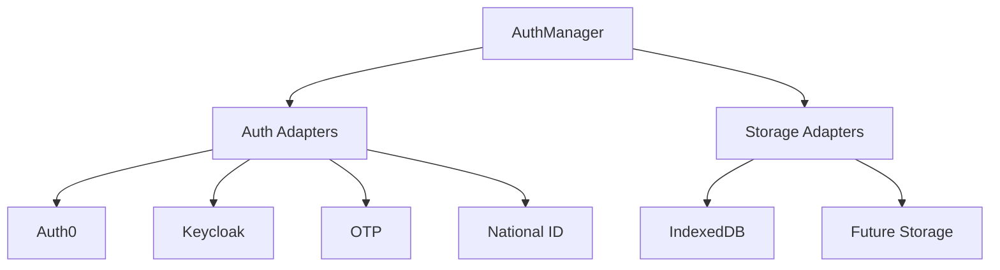
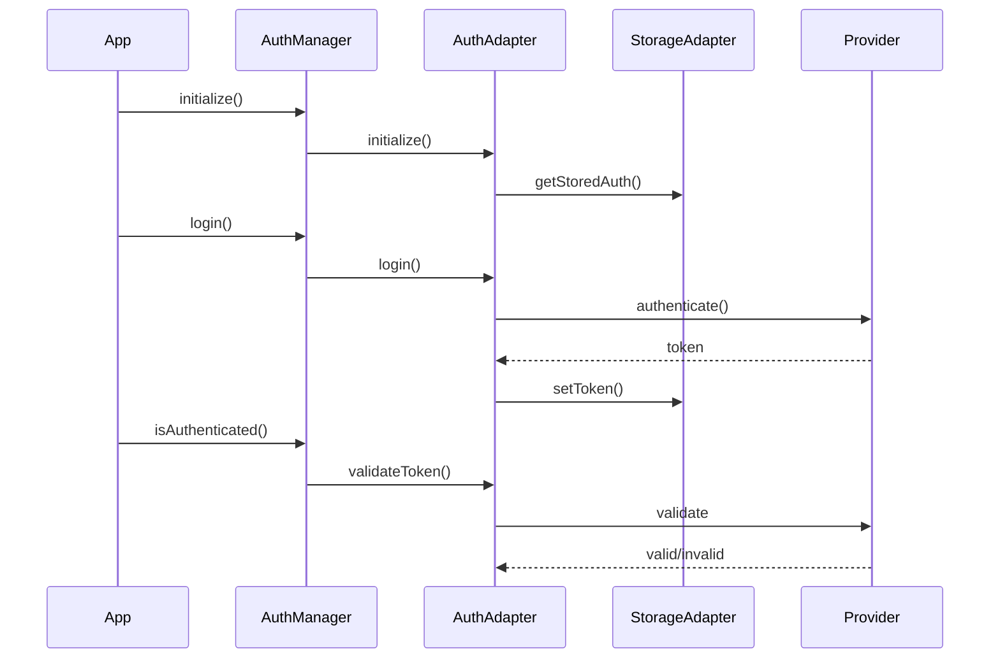
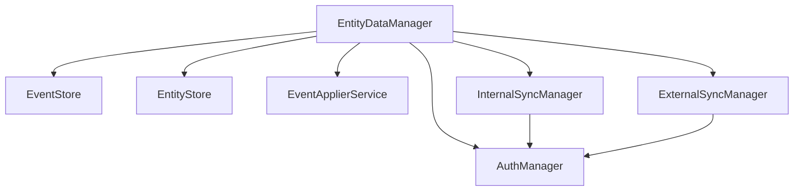

# Authentication Architecture

The ID PASS Data Collect authentication system provides a flexible, secure, and extensible authentication framework that supports multiple authentication providers and secure token storage.

## Overview

The authentication architecture consists of three main components:

1. **AuthManager**: Central authentication coordinator
2. **Auth Adapters**: Provider-specific implementations (Auth0, Keycloak, OTP, National ID)
3. **Storage Adapters**: Token persistence layer



## Core Components

### AuthManager

The `AuthManager` class serves as the central coordinator for authentication operations:

- Manages multiple authentication providers
- Coordinates token storage and retrieval
- Handles authentication state
- Provides unified authentication interface

### Auth Adapters

Provider-specific adapters implement the `AuthAdapter` interface:

- **Auth0Adapter** (`auth0`): Auth0-specific OIDC implementation for field workers
- **KeycloakAdapter** (`keycloak`): Keycloak-specific OIDC implementation for field workers
- **OtpAuthAdapter** (`otp`): One-time password via SMS/email for citizen self-service
- **IdAuthAdapter** (`id`): National ID card verification for citizen self-service
- New adapters can be added by implementing the `AuthAdapter` interface and registering the registry key in `AuthManager`

### Storage Adapters

Storage adapters implement the `AuthStorageAdapter` interface:

- **IndexedDbAuthStorageAdapter**: Browser-based storage
- Extensible for different storage backends
- Multi-tenant support

## Authentication Flow



## Token Management

### Storage

- Tokens are stored securely using the configured storage adapter
- Multi-tenant support through tenant-specific storage instances
- Automatic token cleanup on logout

### Validation

- Provider-specific token validation
- Environment-aware validation (frontend/backend)
- Regular token validation checks

## Security Features

1. **Token Security**
   - Secure token storage
   - Token validation on each use
   - Automatic token cleanup

2. **Provider Integration**
   - OAuth 2.0 and OpenID Connect support
   - Provider-specific security features
   - Organization/Realm-based access control

3. **Multi-tenant Security**
   - Tenant isolation
   - Separate storage per tenant
   - Tenant-specific configurations

## Configuration

### Auth0 Configuration

```typescript
const auth0Config = {
  type: "auth0",
  fields: {
    authority: "https://example.auth0.com",
    client_id: "CLIENT_ID",
    organization: "ORG_ID"
  }
};
```

### Keycloak Configuration

```typescript
const keycloakConfig = {
  type: "keycloak",
  fields: {
    authority: "https://keycloak.example.com",
    client_id: "CLIENT_ID",
    realm: "REALM_NAME"
  }
};
```

### OTP Configuration

The `otp` adapter sends a 6-digit one-time password to a beneficiary's phone number or email address. It is designed for citizen self-service scenarios where beneficiaries do not hold traditional login credentials. The resulting JWT carries a `self-service` scope and is scoped to the matched beneficiary entity.

```typescript
const otpConfig = {
  type: "otp",
  fields: {
    serverUrl: "https://sync.example.com"
  }
};
```

Authentication is a two-step process — call `requestOtp()` first, then `verifyOtp()`:

```typescript
// 1. Request OTP delivery
const { success, expiresIn } = await otpAdapter.requestOtp("+15551234567");

// 2. Verify the received code and retrieve a JWT
const { username, token } = await otpAdapter.verifyOtp("+15551234567", "123456");
```

The standard `login()` method is not supported for this adapter; use `requestOtp()` and `verifyOtp()` directly.

**Backend endpoints used:**
- `POST /api/auth/otp/request` — sends the one-time code
- `POST /api/auth/otp/verify` — exchanges the code for a JWT
- `POST /api/users/check-token` — validates a stored token

### National ID Configuration

The `id` adapter authenticates beneficiaries using a national ID document combined with their date of birth, or via a scanned QR code. It is designed for self-service kiosks or assisted-service workflows where identity documents replace usernames and passwords. The resulting JWT carries a `self-service` scope and is scoped to the matched beneficiary entity.

```typescript
const idConfig = {
  type: "id",
  fields: {
    serverUrl: "https://sync.example.com"
  }
};
```

Two authentication flows are available:

```typescript
// ID document + date of birth
const { username, token } = await idAdapter.authenticateWithId(
  "A1234567",       // national ID number
  "1990-05-15",     // date of birth (ISO 8601)
  "tenant-id"
);

// QR code scan
const { username, token } = await idAdapter.authenticateWithQr(qrCodePayload);
```

The standard `login()` method is not supported for this adapter; use `authenticateWithId()` or `authenticateWithQr()` directly.

**Backend endpoints used:**
- `POST /api/auth/id/verify` — verifies national ID + date of birth
- `POST /api/auth/qr/verify` — verifies QR code payload
- `POST /api/users/check-token` — validates a stored token

## Extension Points

The authentication system can be extended in several ways:

1. **New Auth Providers**
   - Implement `AuthAdapter` interface
   - Add provider-specific configuration
   - Register with `AuthManager` using a new registry key alongside the existing `auth0`, `keycloak`, `otp`, and `id` entries

2. **Storage Backends**
   - Implement `AuthStorageAdapter` interface
   - Add storage-specific configuration
   - Use with existing auth adapters

3. **Custom Validation**
   - Override validation methods
   - Add custom validation rules
   - Implement provider-specific checks

## Best Practices

1. **Security**
   - Use HTTPS in production
   - Implement token rotation
   - Regular token validation
   - Secure storage configuration

2. **Configuration**
   - Environment-specific settings
   - Proper error handling
   - Logging and monitoring

3. **Integration**
   - Single authentication instance
   - Proper initialization order
   - Clean logout handling


## Integration with EntityManager

The `EntityDataManager` integrates with `AuthManager` to provide authenticated data operations and synchronization capabilities:



### Initialization

```typescript
const authManager = new AuthManager(
  [{ 
    type: "mock-auth-adapter", 
    fields: { url: "http://localhost:3000" } 
  }],
  "http://localhost:3000",
  authStorage
);

const entityManager = new EntityDataManager(
  eventStore,
  entityStore,
  eventApplierService,
  externalSyncManager,
  internalSyncManager,
  authManager
);
```

### Authentication Flow

```typescript
// Login
await entityManager.login({ 
  username: "admin@example.com", 
  password: "password123" 
});

// Check for unsynced events
const hasUnsynced = await entityManager.hasUnsyncedEvents();
if (hasUnsynced) {
  // Sync requires authentication
  await entityManager.syncWithSyncServer();
}

// Logout
await entityManager.logout();
```
