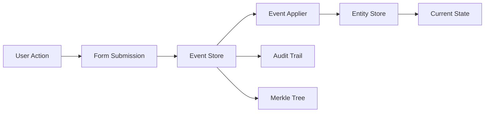

# Event Sourcing Architecture

ID PASS DataCollect implements a comprehensive event sourcing architecture that provides complete audit trails, time-travel debugging, and cryptographic integrity verification. This document explains the design principles, implementation details, and practical usage.

## Overview

Event sourcing is an architectural pattern where all changes to application state are stored as a sequence of events. Instead of storing just the current state, we store a full history of actions that led to that state.



## Core Concepts

### Events as First-Class Citizens

In ID PASS DataCollect, every change is represented as an immutable event:

```typescript
interface FormSubmission {
  guid: string;                // Unique event identifier
  entityGuid: string;          // Entity this event affects
  type: string;                // Event type (create-individual, update-group, etc.)
  data: any;                   // Event payload
  timestamp: string;           // When the event occurred
  userId: string;              // Who created the event
  syncLevel: SyncLevel;        // Synchronization status
}
```

### Event Types

The system supports various event types for different operations:

- **Entity Creation**: `create-individual`, `create-group`
- **Entity Updates**: `update-individual`, `update-group`
- **Group Management**: `add-member`, `remove-member`
- **Entity Deletion**: `delete-entity`
- **Custom Events**: Extensible for domain-specific operations

### Event Store

The EventStore manages immutable event storage with cryptographic integrity:

```typescript
class EventStoreImpl implements EventStore {
  private merkleRoot: MerkleNode | null = null;
  private storageAdapter: EventStorageAdapter;

  async saveEvent(form: FormSubmission): Promise<string> {
    // Store event immutably
    const guids = await this.storageAdapter.saveEvents([form]);
    
    // Update Merkle tree for integrity
    await this.loadMerkleTree();
    
    return guids[0];
  }
}
```

## Implementation Details

### Event Application

Events are applied to entities through the EventApplierService:

```typescript
class EventApplierService {
  async submitForm(formData: FormSubmission): Promise<EntityDoc | null> {
    // 1. Save event to event store
    const eventId = await this.eventStore.saveEvent(formData);
    
    // 2. Apply event to create/update entity
    const entity = await this.applyEvent(formData);
    
    // 3. Save updated entity state
    if (entity) {
      await this.entityStore.saveEntity(entity.initial, entity.modified);
    }
    
    return entity;
  }
}
```

### Custom Event Appliers

You can register custom event appliers for domain-specific logic:

```typescript
// Define custom event applier
const customApplier: EventApplier = {
  eventType: 'assign-case-worker',
  apply: async (entity: EntityDoc, event: FormSubmission): Promise<EntityDoc> => {
    return {
      ...entity,
      data: {
        ...entity.data,
        caseWorker: event.data.caseWorkerId,
        assignmentDate: event.timestamp
      },
      version: entity.version + 1,
      lastUpdated: event.timestamp
    };
  }
};

// Register the applier
eventApplierService.registerEventApplier(customApplier);
```

### Merkle Tree Integrity

Every event is included in a Merkle tree for tamper-evident storage:

```typescript
class MerkleNode {
  left: MerkleNode | null = null;
  right: MerkleNode | null = null;
  hash: string;

  constructor(data: string) {
    this.hash = this.calculateHash(data);
  }

  private calculateHash(data: string): string {
    return CryptoJS.SHA256(data).toString(CryptoJS.enc.Hex);
  }
}
```

## Event Sourcing Benefits

### 1. Complete Audit Trail

Every change is recorded with full context:

```typescript
const auditTrail = await eventStore.getAuditTrailByEntityGuid('person-123');

auditTrail.forEach(entry => {
  console.log(`${entry.timestamp}: ${entry.action} by ${entry.userId}`);
  console.log('Changes:', entry.changes);
});
```

### 2. Time Travel Debugging

Reconstruct entity state at any point in time:

```typescript
async function getEntityAtTime(entityId: string, timestamp: string): Promise<EntityDoc> {
  // Get all events up to the specified time
  const events = await eventStore.getEvents();
  const relevantEvents = events.filter(e => 
    e.entityGuid === entityId && 
    e.timestamp <= timestamp
  );
  
  // Replay events to reconstruct state
  let entity = null;
  for (const event of relevantEvents) {
    entity = await eventApplier.applyEvent(entity, event);
  }
  
  return entity;
}
```

### 3. Event Replay

Rebuild entire system state from events:

```typescript
async function rebuildFromEvents(): Promise<void> {
  // Clear current state
  await entityStore.clearStore();
  
  // Get all events
  const events = await eventStore.getAllEvents();
  
  // Replay in order
  for (const event of events) {
    await eventApplierService.submitForm(event);
  }
}
```

### 4. Cryptographic Verification

Verify data integrity using Merkle proofs:

```typescript
// Get proof for an event
const proof = await eventStore.getProof(suspiciousEvent);

// Verify the event hasn't been tampered with
const isValid = eventStore.verifyEvent(suspiciousEvent, proof);

if (!isValid) {
  throw new Error('Data integrity compromised!');
}
```

## Event Design Patterns

### 1. Command-Event Separation

Commands represent intentions, events represent facts:

```typescript
// Command (intent)
interface CreateIndividualCommand {
  name: string;
  age: number;
  address: Address;
}

// Event (fact)
interface IndividualCreatedEvent extends FormSubmission {
  type: 'create-individual';
  data: {
    name: string;
    age: number;
    address: Address;
    createdAt: string;
  };
}
```

### 2. Event Enrichment

Add metadata during event creation:

```typescript
function enrichEvent(event: FormSubmission): FormSubmission {
  return {
    ...event,
    metadata: {
      deviceId: getDeviceId(),
      location: getCurrentLocation(),
      appVersion: getAppVersion(),
      networkStatus: getNetworkStatus()
    }
  };
}
```

### 3. Event Versioning

Handle schema evolution:

```typescript
interface VersionedEvent extends FormSubmission {
  version: number;
  migratedFrom?: number;
}

function migrateEvent(event: VersionedEvent): VersionedEvent {
  switch (event.version) {
    case 1:
      // Migrate v1 to v2
      return {
        ...event,
        version: 2,
        data: migrateV1ToV2(event.data)
      };
    default:
      return event;
  }
}
```

## Performance Considerations

### Event Storage Optimization

1. **Indexing Strategy**
   ```typescript
   // IndexedDB indexes for fast queries
   db.createIndex('timestamp', 'timestamp');
   db.createIndex('entityGuid', 'entityGuid');
   db.createIndex('type', 'type');
   ```

2. **Pagination for Large Event Sets**
   ```typescript
   const result = await eventStore.getEventsSincePagination(
     lastSyncTime,
     100 // Page size
   );
   ```

3. **Batch Event Processing**
   ```typescript
   const events = collectEvents(); // Collect multiple events
   await eventStore.saveEvents(events); // Save in batch
   ```

### Memory Management

1. **Streaming Event Processing**
   ```typescript
   async function* streamEvents() {
     let cursor = null;
     do {
       const batch = await eventStore.getEventsBatch(cursor, 1000);
       yield* batch.events;
       cursor = batch.nextCursor;
     } while (cursor);
   }
   ```

2. **Event Compaction**
   ```typescript
   // Periodically compact events into snapshots
   async function createSnapshot(entityId: string): Promise<void> {
     const entity = await entityStore.getEntity(entityId);
     await snapshotStore.saveSnapshot({
       entityId,
       state: entity.modified,
       eventCount: entity.version,
       timestamp: new Date().toISOString()
     });
   }
   ```

## Security Considerations

### 1. Event Immutability

Events are write-once, read-many:

```typescript
class ImmutableEventStore {
  async saveEvent(event: FormSubmission): Promise<void> {
    // Check if event already exists
    if (await this.isEventExisted(event.guid)) {
      throw new Error('Event already exists - cannot modify');
    }
    
    // Save with integrity hash
    await this.storage.save({
      ...event,
      hash: this.calculateHash(event)
    });
  }
}
```

### 2. Access Control

Implement role-based event access:

```typescript
function canAccessEvent(user: User, event: FormSubmission): boolean {
  // Admin can see all events
  if (user.role === 'admin') return true;
  
  // Users can only see their own events
  if (user.id === event.userId) return true;
  
  // Check entity-level permissions
  return hasEntityPermission(user, event.entityGuid);
}
```

### 3. Event Encryption

Encrypt sensitive event data:

```typescript
class EncryptedEventStore {
  async saveEvent(event: FormSubmission): Promise<void> {
    const encrypted = {
      ...event,
      data: await this.encryptionAdapter.encrypt(
        JSON.stringify(event.data)
      )
    };
    
    await this.storage.save(encrypted);
  }
}
```

## Best Practices

### 1. Event Naming

Use clear, descriptive event names:

```typescript
// Good
'beneficiary-registered'
'household-income-updated'
'emergency-assistance-provided'

// Avoid
'update'
'change'
'event-1'
```

### 2. Event Granularity

Balance between too many small events and large monolithic events:

```typescript
// Too granular
{ type: 'name-changed', data: { name: 'John' } }
{ type: 'age-changed', data: { age: 30 } }

// Too coarse
{ type: 'entity-updated', data: { ...entireEntity } }

// Just right
{ type: 'personal-info-updated', data: { name: 'John', age: 30 } }
```

### 3. Event Context

Include sufficient context for event replay:

```typescript
interface ContextualEvent extends FormSubmission {
  context: {
    reason: string;
    source: 'mobile-app' | 'web-portal' | 'import';
    sessionId: string;
    correlationId: string;
  };
}
```

## Testing Event Sourcing

### Unit Testing Events

```typescript
describe('Event Application', () => {
  it('should apply create-individual event', async () => {
    const event: FormSubmission = {
      guid: 'event-1',
      entityGuid: 'person-1',
      type: 'create-individual',
      data: { name: 'John Doe', age: 30 },
      timestamp: new Date().toISOString(),
      userId: 'test-user',
      syncLevel: SyncLevel.LOCAL
    };
    
    const result = await eventApplier.apply(null, event);
    
    expect(result).toMatchObject({
      id: 'person-1',
      type: 'individual',
      data: { name: 'John Doe', age: 30 }
    });
  });
});
```

### Integration Testing

```typescript
describe('Event Sourcing Integration', () => {
  it('should maintain consistency through event replay', async () => {
    // Create initial state
    await submitEvents(testEvents);
    const originalState = await getAllEntities();
    
    // Clear and replay
    await clearAllStores();
    await replayEvents(testEvents);
    const replayedState = await getAllEntities();
    
    // States should match
    expect(replayedState).toEqual(originalState);
  });
});
```

## Monitoring and Debugging

### Event Metrics

Track key metrics for system health:

```typescript
interface EventMetrics {
  totalEvents: number;
  eventsPerSecond: number;
  averageEventSize: number;
  eventTypeDistribution: Record<string, number>;
  failedEvents: number;
  merkleTreeDepth: number;
}
```

### Debug Utilities

```typescript
// Event inspector
async function inspectEvent(eventId: string): Promise<void> {
  const event = await eventStore.getEvent(eventId);
  console.log('Event:', event);
  
  const proof = await eventStore.getProof(event);
  console.log('Merkle Proof:', proof);
  
  const isValid = eventStore.verifyEvent(event, proof);
  console.log('Integrity Valid:', isValid);
}

// Event timeline
async function printEventTimeline(entityId: string): Promise<void> {
  const events = await eventStore.getEventsByEntity(entityId);
  
  events.forEach((event, index) => {
    console.log(`${index + 1}. ${event.timestamp} - ${event.type}`);
    console.log(`   User: ${event.userId}`);
    console.log(`   Data: ${JSON.stringify(event.data, null, 2)}`);
  });
}
```

## Conclusion

Event sourcing in ID PASS DataCollect provides a robust foundation for:

- **Reliability**: Complete audit trails and data integrity
- **Flexibility**: Easy to add new event types and behaviors
- **Debugging**: Time-travel and event replay capabilities
- **Security**: Cryptographic verification and immutability
- **Compliance**: Full history for regulatory requirements

By following these patterns and best practices, you can build reliable, auditable systems that maintain complete history while supporting complex business requirements.