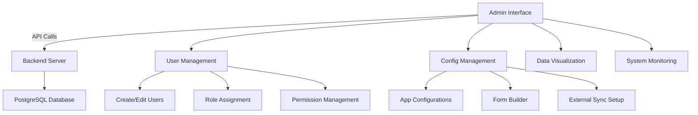
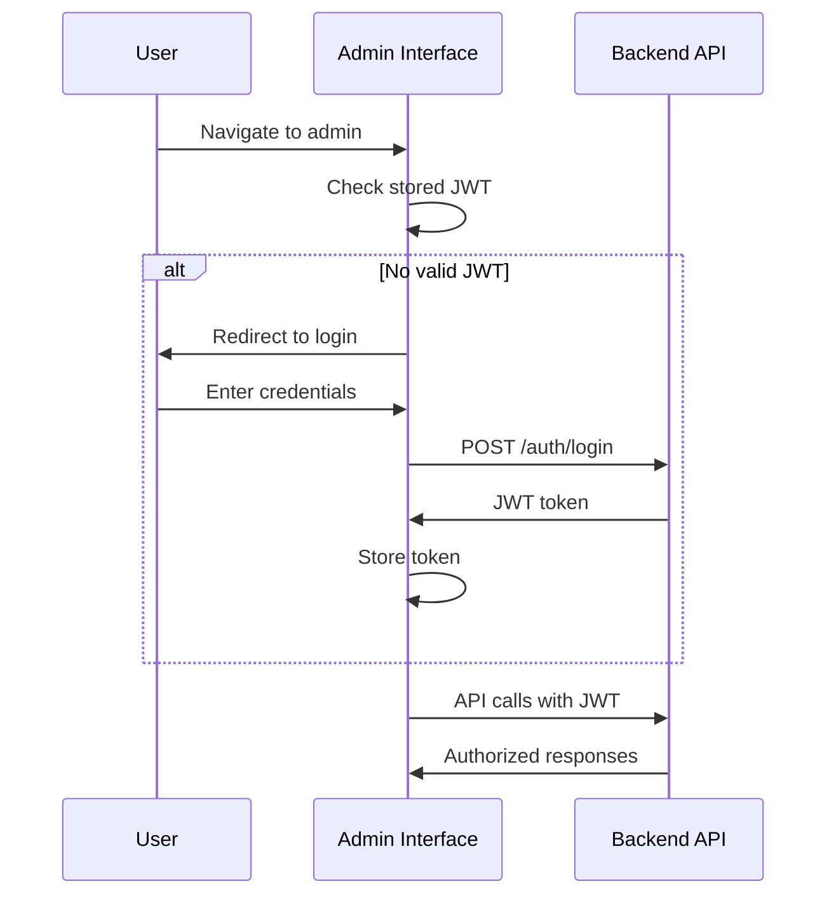

# Admin Package

The Admin package provides a Vue.js-based web interface for managing ID PASS DataCollect deployments, including user management, configuration, and data visualization.

Built with Vue 3, TypeScript, and modern web technologies, the Admin interface offers a comprehensive management solution for:
- User account management
- Multi-tenant configuration
- Data visualization and analytics
- System monitoring and health checks

### Key Features

- 👥 **User Management**: Create, update, and manage user accounts and roles
- ⚙️ **Configuration Management**: Multi-tenant app configuration with form builders
- 📊 **Data Visualization**: View and analyze collected data with charts and tables
- 🎨 **Customizable Interface**: Theming and branding options
- 📱 **Responsive Design**: Works on desktop, tablet, and mobile devices
- 🔐 **Secure Access**: Role-based access control with JWT authentication

## Architecture



## Core Features

### User Management
Complete user administration capabilities:
- **User Creation**: Add new users with role assignment
- **Role Management**: Admin and user roles with different permissions
- **Account Status**: Enable/disable user accounts
- **Password Management**: Password reset and security policies

### Configuration Management
Multi-tenant configuration interface:
- **App Configurations**: Manage tenant-specific settings
- **Form Builder**: Visual form creation with FormIO integration
- **Entity Definitions**: Define custom data structures
- **External Sync**: Configure integrations with external systems

### Data Visualization
Analytics and reporting dashboard:
- **Entity Overview**: Summary of groups and individuals
- **Sync Status**: Real-time synchronization monitoring
- **User Activity**: Track user actions and system usage
- **Data Export**: Export data in various formats
- **Duplicate Review**: Queue of potential duplicate entity pairs for admin resolution

## Quick Start

### Installation

```bash
cd admin
pnpm install
```

### Development Setup

Create a `.env` file:

```env
VITE_API_URL=http://localhost:3000
```

### Development

```bash
pnpm dev
```

The admin interface will be available at `http://localhost:5173`

### Production Build

```bash
pnpm build
pnpm preview  # Preview production build
```

## User Interface

### Dashboard
Main overview with key metrics:
- Total users and active sessions
- Sync status across all clients
- Recent activity and notifications
- System health indicators

### User Management
Comprehensive user administration:
- User list with search and filtering
- User creation and editing forms
- Role assignment interface
- Account status management

### Configuration Management
App configuration interface:
- Configuration list and selection
- Form builder for entity definitions
- External sync setup wizard
- Configuration validation and testing

### Data Viewer
Entity and data visualization:
- Interactive data tables
- Search and filtering capabilities
- Export functionality
- Data validation reports
- Potential duplicates review queue fed by sync conflict detection

## Duplicate Detection (v2.0.0)

DataCollect automatically detects potential duplicate entities during data entry and surfaces them in the Admin interface for review. Unresolved duplicates block external sync, so the review queue should be checked before triggering external synchronisation.

### How detection works

After every `create` or `update` form submission, the `DuplicateDetectionService` asynchronously scans the entity store for other entities that share the same data field values. Detection runs **off the write path** using a background queue (setTimeout) so that `submitForm()` returns immediately and data collection is never blocked.

The algorithm flattens the entity's `data` object into dot-notation key-value pairs (e.g. `address.city`) and runs a search for other entities sharing those values. Any match other than the entity itself is flagged as a potential duplicate pair and stored in the `potential_duplicates` table.

Detection results are **advisory only**: they never block writes, sync, or any other operation — except external sync (see below).

### Impact on external sync

External sync will not run while there are unresolved potential duplicate pairs in the queue. This prevents duplicate records from being pushed to integrated systems such as OpenSPP. Resolve all outstanding duplicates in the Admin interface before triggering external sync.

### Resolving duplicates in the Admin UI

Administrators access the duplicate review queue via the **Data Viewer** section of the admin interface (requires the Admin role).

For each flagged pair, two resolution options are available:

| Action | Effect |
| :--- | :--- |
| **Keep both** | Marks the pair as reviewed without deleting either entity. Both records remain in the system. |
| **Delete new** | Submits a `resolve-duplicate` form with `shouldDelete: true`, which deletes the newly created entity and retains the existing one. |

The resolution is submitted as a standard form event and is therefore audited and synchronised like any other data change.

### REST API

The duplicate detection endpoints are available under `/api/potential-duplicates` and require the Admin JWT role:

```
GET  /api/potential-duplicates?configId=<tenant-id>
     Returns an array of { entityGuid, duplicateGuid } pairs.

POST /api/potential-duplicates/resolve
     Body: { newItem, existingItem, shouldDeleteNewItem, configId }
     Resolves a single pair.
```

### Configuration

Duplicate detection is always enabled and requires no configuration. Detection rules are based on the entity's data fields: any two entities sharing at least one non-empty field value will be flagged as a potential duplicate pair.

## Authentication Flow



## Configuration

### Environment Variables

```env
# API Configuration
VITE_API_URL=http://localhost:3000

# Feature Flags
VITE_ENABLE_ANALYTICS=true
VITE_ENABLE_EXPORT=true

# Branding
VITE_APP_TITLE="ID PASS DataCollect Admin"
VITE_APP_LOGO_URL="/logo.svg"
```

### Build Configuration

Vite configuration supports:
- TypeScript compilation
- Vue 3 composition API
- CSS preprocessing
- Asset optimization
- Environment-specific builds

## Components

### Core Components

#### UserManager
Complete user management interface:
```vue
<template>
  <UserManager 
    :users="users" 
    @create-user="handleCreateUser"
    @edit-user="handleEditUser"
    @delete-user="handleDeleteUser"
  />
</template>
```

#### ConfigEditor
App configuration management:
```vue
<template>
  <ConfigEditor 
    :config="appConfig"
    @save="handleSaveConfig"
    @validate="handleValidateConfig"
  />
</template>
```

#### DataViewer
Entity data visualization:
```vue
<template>
  <DataViewer 
    :entities="entities"
    :filters="filters"
    @export="handleExport"
    @refresh="handleRefresh"
  />
</template>
```

### Shared Components
Reusable UI components:
- Form input components
- Data table with sorting/filtering
- Modal dialogs
- Loading states
- Error handling

## Theming and Customization

### CSS Variables
Customize the interface appearance:

```css
:root {
  --primary-color: #1976d2;
  --secondary-color: #424242;
  --accent-color: #82b1ff;
  --background-color: #fafafa;
  --surface-color: #ffffff;
  --text-primary: #212121;
  --text-secondary: #757575;
}
```

### Logo and Branding
- Custom logo support
- Configurable application title
- Favicon customization
- Color scheme theming

### Layout Options
- Sidebar navigation
- Top navigation bar
- Responsive breakpoints
- Dark/light mode support

## Testing

### Unit Tests
```bash
pnpm test:unit
```

### Component Testing
```bash
pnpm test:component
```

### End-to-End Tests
```bash
pnpm test:e2e
```

## Deployment

### Static Hosting
Deploy built assets to:
- Nginx/Apache web servers
- CDN services (Cloudflare, AWS CloudFront)
- Static hosting platforms (Netlify, Vercel)

### Docker Deployment
```dockerfile
FROM nginx:alpine
COPY dist/ /usr/share/nginx/html/
COPY nginx.conf /etc/nginx/nginx.conf
```

### Environment-Specific Builds
```bash
# Development
pnpm build:dev

# Staging
pnpm build:staging

# Production
pnpm build:prod
```

## Browser Support

- Chrome 88+
- Firefox 85+
- Safari 14+
- Edge 88+

## Accessibility

- WCAG 2.1 AA compliance
- Keyboard navigation
- Screen reader support
- High contrast mode
- Focus management

## Performance

- Code splitting by routes
- Lazy loading of components
- Image optimization
- Bundle size optimization
- Service worker for caching

## Next Steps

- 📖 [User Guide](../../user-guide/) - How to use the admin interface
- 🚀 [Deployment Guide](../../deployment/) - Production deployment
