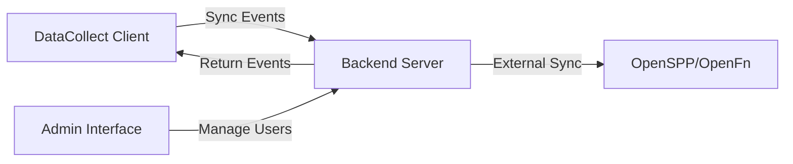

# DataCollect Package

The DataCollect package is the core client library for ID PASS DataCollect, providing offline-first data management capabilities for household and individual beneficiary data.

DataCollect implements event sourcing and CQRS patterns to create a robust, auditable system for managing complex data structures while supporting offline operation.

### Key Features

- 🗄️ **Offline-First**: Full functionality without internet connectivity using IndexedDB
- 📝 **Event Sourcing**: Complete audit trail with ability to replay state changes
- 🔄 **Synchronization**: Bi-directional sync with central server
- 🔐 **Encryption**: Client-side data encryption support
- 📱 **Cross-Platform**: Works in browsers, React Native, and Electron apps

## Core Components

### EntityDataManager
Central orchestrator for all data operations, providing a clean API for:
- Form submission processing
- Entity state management
- Synchronization coordination

### EventStore & EntityStore
- **EventStore**: Immutable event log with hash chain integrity
- **EntityStore**: Current state of all entities (Groups, Individuals, and Records)

### Sync Managers
- **InternalSyncManager**: Client ↔ Server synchronization
- **ExternalSyncManager**: Server ↔ External system integration

## Entity Types

DataCollect supports three entity types that map to common beneficiary program concepts:

| Type | `EntityType` | Typical uses |
| :--- | :--- | :--- |
| Group | `EntityType.Group` | Households, families, program cohorts |
| Individual | `EntityType.Individual` | Persons, beneficiaries |
| Record | `EntityType.Record` | Activities, services, visits, events linked to a group or individual |

### Record Entities (v2.0.0)

A **Record** is an activity or service log attached to an existing group or individual. Unlike groups and individuals — which represent _who_ is in the program — records capture _what happened_: a home visit, a training session, a grievance filing, an assistance disbursement, or any other time-bound interaction.

#### TypeScript interface

```typescript
interface RecordDoc extends EntityDoc {
  type: EntityType.Record;
  /** GUID of the parent entity this record belongs to (optional) */
  parentEntityGuid?: string;
}
```

Records extend `EntityDoc` and therefore carry the same `guid`, `data`, `syncLevel`, and version fields as all other entities. The `parentEntityGuid` field optionally links a record to the group or individual it belongs to.

#### Configuring record forms

Set `entityType: "record"` on a form definition in your app configuration to tell DataCollect that submissions should produce `create-record` / `update-record` events rather than entity-creation events:

```json
{
  "entityForms": [
    {
      "name": "home-visit",
      "title": "Home Visit",
      "entityType": "record",
      "formio": { }
    },
    {
      "name": "training",
      "title": "Training Attendance",
      "entityType": "record",
      "formio": { }
    }
  ]
}
```

Forms that have a `dependsOn` relationship with a parent entity form are automatically classified as record forms by the `FormClassifier` service, even without an explicit `entityType` field.

#### Creating records programmatically

```typescript
await manager.submitForm({
  guid: crypto.randomUUID(),
  type: 'create-record',
  entityGuid: crypto.randomUUID(),   // new record's own GUID
  data: {
    visitDate: '2025-03-01',
    notes: 'Household visited, 4 members present',
    parentId: householdGuid           // links to the parent entity
  },
  timestamp: new Date().toISOString(),
  userId: currentUserId,
  syncLevel: SyncLevel.LOCAL
});
```

The `EventApplierService` handles `create-record` and `update-record` form types and stores the resulting entity with `type: EntityType.Record`. The `data.parentId` field is automatically promoted to `parentEntityGuid` on the stored document.

#### Querying records

Records are stored in the same `EntityStore` as groups and individuals. Filter by type to retrieve them:

```typescript
const records = await entityStore.searchEntities([
  { type: EntityType.Record }
]);

// Records belonging to a specific parent
const visitsForHousehold = await entityStore.searchEntities([
  { type: EntityType.Record },
  { parentEntityGuid: householdGuid }
]);
```

#### How records differ from groups and individuals

- **Groups** contain member references (`memberIds`). Records do not.
- **Individuals** represent people. Records represent events or services.
- **Records** are always associated with an activity in time. They have a `parentEntityGuid` pointing to the group or individual they describe.
- All three types sync with the server in the same way — via the standard internal sync pipeline — and are subject to the same audit trail and conflict resolution mechanisms.

## Quick Start

### Installation

```bash
cd ./packages/datacollect
pnpm install
pnpm build
```

### Basic Usage

```typescript
import {
  EntityDataManager,
  IndexedDbEntityStorageAdapter,
  IndexedDbEventStorageAdapter,
  IndexedDbAuthStorageAdapter,
  EventStoreImpl,
  EntityStoreImpl,
  EventApplierService,
  InternalSyncManager,
  ExternalSyncManager,
  AuthManager
} from 'idpass-data-collect';

// Initialize storage adapters
const eventStorageAdapter = new IndexedDbEventStorageAdapter('my-events');
const entityStorageAdapter = new IndexedDbEntityStorageAdapter('my-entities');
const authStorageAdapter = new IndexedDbAuthStorageAdapter('my-auth');

// Initialize stores
const eventStore = new EventStoreImpl(eventStorageAdapter);
const entityStore = new EntityStoreImpl(entityStorageAdapter);
await eventStore.initialize();
await entityStore.initialize();
await authStorageAdapter.initialize();

// Set up services
const eventApplierService = new EventApplierService(eventStore, entityStore);

// Create sync managers
const internalSyncManager = new InternalSyncManager(
  eventStore,
  entityStore,
  eventApplierService,
  'http://your-sync-server.com',
  authStorageAdapter
);

const externalSyncManager = new ExternalSyncManager(
  eventStore,
  eventApplierService,
  {
    type: 'mock-sync-server',
    url: 'http://localhost:4000',
    auth: '',
    extraFields: {}
  }
);

// Create authentication manager
const authManager = new AuthManager(
  [
    {
      type: 'auth0',
      fields: {
        domain: 'your-domain.auth0.com',
        clientId: 'your-client-id',
        audience: 'your-api-audience',
        scope: 'openid profile email'
      }
    }
  ],
  'http://your-sync-server.com',
  authStorageAdapter
);

// Create the main manager
const manager = new EntityDataManager(
  eventStore,
  entityStore,
  eventApplierService,
  externalSyncManager,
  internalSyncManager,
  authManager
);
```

## Documentation Sections

### [API Reference](/packages/datacollect/api)
Complete TypeScript API documentation with examples

### [Tutorials](../../getting-started/tutorials)
Step-by-step guides for common use cases:
- Creating your first DataCollection app
- Implementing custom event types
- Setting up offline-online synchronization

### [Configuration](../../getting-started/configuration)
Configuration options and environment setup

### [Examples](../../examples/basic-usage/README.md)
Working code examples for different scenarios

## Architecture Integration

DataCollect works as part of the larger ID PASS ecosystem:


```mermaid
graph LR
    A[DataCollect Client] -->|Sync Events| B[Backend Server]
    B -->|Return Events| A
    B -->|External Sync| C[OpenSPP/OpenFn]
    D[Admin Interface] -->|Manage Users| B
```

## Performance Characteristics

- **Storage**: Efficient IndexedDB usage with pagination
- **Memory**: Event streaming with configurable batch sizes
- **Sync**: Incremental synchronization with conflict resolution
- **Scalability**: Tested with 10,000+ entities per client

## Browser Support

- Chrome 60+
- Firefox 60+
- Safari 12+
- Edge 79+

## Next Steps

- 📖 [Tutorials](../../getting-started/tutorials) - Learn by building
- 🚀 [Backend Package](../../packages/backend/) - Add server synchronization
- 👥 [Admin Package](../../packages/admin/) - Complete management solution
