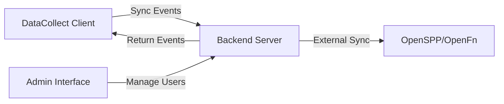

# DataCollect Package

The DataCollect package is the core client library for ID PASS DataCollect, providing offline-first data management capabilities for household and individual beneficiary data.

DataCollect implements event sourcing and CQRS patterns to create a robust, auditable system for managing complex data structures while supporting offline operation.

### Key Features

- 🗄️ **Offline-First**: Full functionality without internet connectivity using IndexedDB
- 📝 **Event Sourcing**: Complete audit trail with ability to replay state changes
- 🔄 **Synchronization**: Bi-directional sync with central server
- 🔐 **Encryption**: Client-side data encryption support
- 📱 **Cross-Platform**: Works in browsers, React Native, and Electron apps

## Core Components

### EntityDataManager
Central orchestrator for all data operations, providing a clean API for:
- Form submission processing
- Entity state management
- Synchronization coordination

### EventStore & EntityStore
- **EventStore**: Immutable event log with Merkle tree integrity
- **EntityStore**: Current state of all entities (Groups and Individuals)

### Sync Managers
- **InternalSyncManager**: Client ↔ Server synchronization
- **ExternalSyncManager**: Server ↔ External system integration

## Quick Start

### Installation

```bash
cd ./packages/datacollect
npm install
npm run build
```

### Basic Usage

```typescript
import {
  EntityDataManager,
  IndexedDbEntityStorageAdapter,
  IndexedDbEventStorageAdapter,
  IndexedDbAuthStorageAdapter,
  EventStoreImpl,
  EntityStoreImpl,
  EventApplierService,
  InternalSyncManager,
  ExternalSyncManager,
  AuthManager
} from 'idpass-data-collect';

// Initialize storage adapters
const eventStorageAdapter = new IndexedDbEventStorageAdapter('my-events');
const entityStorageAdapter = new IndexedDbEntityStorageAdapter('my-entities');
const authStorageAdapter = new IndexedDbAuthStorageAdapter('my-auth');

// Initialize stores
const eventStore = new EventStoreImpl(eventStorageAdapter);
const entityStore = new EntityStoreImpl(entityStorageAdapter);
await eventStore.initialize();
await entityStore.initialize();
await authStorageAdapter.initialize();

// Set up services
const eventApplierService = new EventApplierService(eventStore, entityStore);

// Create sync managers
const internalSyncManager = new InternalSyncManager(
  eventStore,
  entityStore,
  eventApplierService,
  'http://your-sync-server.com',
  authStorageAdapter
);

const externalSyncManager = new ExternalSyncManager(
  eventStore,
  eventApplierService,
  {
    type: 'mock-sync-server',
    url: 'http://localhost:4000',
    auth: '',
    extraFields: {}
  }
);

// Create authentication manager
const authManager = new AuthManager(
  [
    {
      type: 'auth0',
      fields: {
        domain: 'your-domain.auth0.com',
        clientId: 'your-client-id',
        audience: 'your-api-audience',
        scope: 'openid profile email'
      }
    }
  ],
  'http://your-sync-server.com',
  authStorageAdapter
);

// Create the main manager
const manager = new EntityDataManager(
  eventStore,
  entityStore,
  eventApplierService,
  externalSyncManager,
  internalSyncManager,
  authManager
);
```

## Documentation Sections

### [API Reference](/packages/datacollect/api)
Complete TypeScript API documentation with examples

### [Tutorials](../../getting-started/tutorials)
Step-by-step guides for common use cases:
- Creating your first DataCollection app
- Implementing custom event types
- Setting up offline-online synchronization

### [Configuration](../../getting-started/configuration)
Configuration options and environment setup

### [Examples](../../examples/basic-usage/README.md)
Working code examples for different scenarios

## Architecture Integration

DataCollect works as part of the larger ID PASS ecosystem:



## Performance Characteristics

- **Storage**: Efficient IndexedDB usage with pagination
- **Memory**: Event streaming with configurable batch sizes
- **Sync**: Incremental synchronization with conflict resolution
- **Scalability**: Tested with 10,000+ entities per client

## Browser Support

- Chrome 60+
- Firefox 60+
- Safari 12+
- Edge 79+

## Next Steps

- 📖 [Tutorials](../../getting-started/tutorials) - Learn by building
- 🚀 [Backend Package](../../packages/backend/) - Add server synchronization
- 👥 [Admin Package](../../packages/admin/) - Complete management solution
