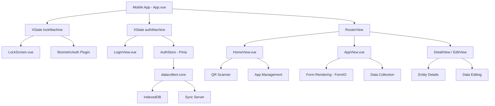

# Mobile Package

The Mobile package is an offline-first client application for ID PASS DataCollect that serves as a mobile data collection interface. It operates as a client instance that synchronizes with the DataCollect sync server when connectivity is available, enabling reliable data collection in environments with intermittent or no internet connectivity.

The Mobile package provides a Vue.js-based mobile application for ID PASS DataCollect, built with Capacitor for cross-platform mobile development. It supports both traditional form-based data collection and dynamic app configurations.

Built with Vue 3, Vuetify 3, TypeScript, XState v5, and Capacitor, the mobile application offers a flexible data collection solution for:
- Dynamic app configuration loading via QR codes or URLs
- Traditional form-based data collection
- Offline-first data storage via the `@idpass/data-collect-core` library (IndexedDB)
- Cross-platform mobile deployment (iOS/Android)

### Key Features

- **Cross-Platform**: Native mobile apps for iOS and Android using Capacitor
- **Dynamic App Loading**: Load app configurations via QR code scanning or URL input
- **Form Builder Integration**: Full FormIO integration for dynamic form creation
- **Offline Storage**: IndexedDB-backed local storage via `@idpass/data-collect-core`
- **Secure Authentication**: JWT-based authentication with OAuth provider support (Auth0, Keycloak), managed by XState v5 state machines
- **Biometric App Lock**: Device biometric authentication (fingerprint/face) via XState-driven lock machine and `@aparajita/capacitor-biometric-auth`
- **Secure Storage**: Sensitive credentials stored with `@aparajita/capacitor-secure-storage`
- **Multi-Provider Auth**: Support for multiple authentication providers per app configuration
- **QR Code Scanning**: Built-in barcode scanning for app configuration loading
- **Material Design 3 UI**: Vuetify 3 components for a consistent, mobile-optimized interface
- **Error Overlay**: Global error handling with user-facing snackbar notifications

## Technology Stack

| Layer | Technology |
| :--- | :--- |
| UI Framework | Vue 3 + Vuetify 3 (Material Design 3) |
| State Management | XState v5 (`authMachine`, `lockMachine`) + Pinia |
| Storage | IndexedDB via `@idpass/data-collect-core` |
| Platform Bridge | Capacitor 6 |
| Biometrics | `@aparajita/capacitor-biometric-auth` |
| Secure Storage | `@aparajita/capacitor-secure-storage` |
| Forms | FormIO (`@formio/vue`, `formiojs`) |
| Auth | JWT + OAuth (Auth0 / Keycloak) |

## Architecture


```mermaid
graph TB
    A[Mobile App - App.vue] --> B[XState lockMachine]
    A --> C[XState authMachine]
    A --> D[RouterView]

    B --> E[LockScreen.vue]
    B --> F[BiometricAuth Plugin]

    C --> G[LoginView.vue]
    C --> H[AuthStore - Pinia]

    D --> I[HomeView.vue]
    D --> J[AppView.vue]
    D --> K[DetailView / EditView]

    I --> L[QR Scanner]
    I --> M[App Management]

    J --> N[Form Rendering - FormIO]
    J --> O[Data Collection]

    K --> P[Entity Details]
    K --> Q[Data Editing]

    H --> R[datacollect-core]
    R --> S[IndexedDB]
    R --> T[Sync Server]
```

## Core Features

### Dynamic App Configuration
The mobile app supports loading app configurations dynamically:
- **QR Code Scanning**: Scan QR codes to load app configurations
- **URL Input**: Manually enter app configuration URLs
- **Local Storage**: Store multiple app configurations locally using IndexedDB via `@idpass/data-collect-core`
- **App Switching**: Switch between different app configurations

### Form-Based Data Collection
Traditional form-based data collection:
- **FormIO Integration**: Full FormIO form builder support
- **Dynamic Forms**: Render forms based on configuration
- **Data Validation**: Client-side and server-side validation
- **File Upload**: Support for image and document uploads

### Offline Capabilities
Offline-first data collection:
- **IndexedDB Storage**: Local data persistence via the `@idpass/data-collect-core` library's `IndexedDbStorageAdapter`
- **Sync Management**: Background synchronization when online
- **Conflict Resolution**: Handle data conflicts during sync via the core library's event-sourcing model

### Biometric App Lock (v2.0.0)
A `lockMachine` (XState v5) manages the app lock lifecycle:
- Automatically locks after a configurable inactivity timeout (default: 5 minutes)
- Prompts for biometric authentication (fingerprint/face ID) on unlock
- The `LockScreen` component renders over all app content while locked
- Lock state is persisted via `@aparajita/capacitor-secure-storage`

### XState Auth/Lock Flows (v2.0.0)
Authentication and lock state are managed by two XState v5 state machines:
- **`authMachine`**: Handles the full auth lifecycle — initialization, username/password login, OAuth callback handling, token refresh, and logout
- **`lockMachine`**: Handles inactivity-based locking, biometric unlock attempts, and persisted lock state

## Authentication

### Authentication Setup
The mobile app authentication is driven by the `authMachine` XState state machine and exposed via the `useAuthStore` Pinia store.

#### Username/Password Authentication
```typescript
import { useAuthStore } from '@/store/auth';

const authStore = useAuthStore();

// Login with credentials
await authStore.loginSyncServer(syncServerUrl, {
  email: 'user@example.com',
  password: 'password123'
});
```

#### OAuth Provider Authentication
```typescript
// Auth0 login via authMachine
const auth0Config = {
  type: 'auth0',
  fields: {
    domain: config.domain,
    client_id: config.client_id,
    scope: 'openid profile email'
  }
};

// The authMachine actor handles the OAuth flow and callback
authStore.send({ type: 'LOGIN', provider: 'auth0' });
```

### Authentication Components

#### LoginView.vue
The login view uses Vuetify 3 components for a Material Design layout:
```vue
<template>
  <v-container class="fill-height">
    <v-row justify="center" align="center" class="fill-height">
      <v-col cols="12" sm="8" md="5" lg="4">
        <v-form @submit.prevent="onLogin">
          <v-text-field
            v-model="form.email"
            label="Email"
            type="email"
            required
          />
          <v-text-field
            v-model="form.password"
            label="Password"
            type="password"
            required
          />
          <v-btn type="submit" color="secondary" variant="flat" size="large">
            Login
          </v-btn>
        </v-form>
      </v-col>
    </v-row>
  </v-container>
</template>
```

#### Route Guards
Authentication state from the `authMachine` is used to protect routes:
```typescript
// Route guard for authentication
export const authGuard = async (to: any, from: any, next: any) => {
  const authStore = useAuthStore();

  if (authStore.isAuthenticated) {
    next();
  } else {
    next('/login');
  }
};
```

## Quick Start

### Installation

```bash
cd ./packages/mobile
pnpm install
```

### Development Setup

Create a `.env` file:

```env
# Database Configuration
VITE_DB_ENCRYPTION_PASSWORD=password
VITE_FEATURE_DYNAMIC=true
VITE_DEVELOP=true
```

### Development

```bash
pnpm run dev
```

The mobile app will be available at `http://localhost:8081`

### Mobile Development

```bash
# Build for iOS
pnpm run build:ios

# Build for Android
pnpm run build:android
```

## Application Structure

### Root Component

#### App.vue
The root component initializes the `AppLockService` and renders the Vuetify application shell with bottom navigation, offline indicator, and global overlays:

```vue
<template>
  <v-app>
    <LockScreen v-if="AppLockService.locked" />
    <AppSnackbar />
    <!-- ... bottom navigation, router view ... -->
  </v-app>
</template>

<script setup lang="ts">
import { onMounted } from 'vue';
import { AppLockService } from '@/services/AppLockService';

onMounted(async () => {
  await AppLockService.init();
});
</script>
```

### Views

| View | Route | Description |
| :--- | :--- | :--- |
| `HomeView.vue` | `/` | App list and QR scanner entry point |
| `AppView.vue` | `/app/:id` | Dynamic form rendering for a loaded app config |
| `LoginView.vue` | `/login/:id` | Sync server credential login |
| `DetailView.vue` | `/app/:id/entity/:eid` | Read-only entity detail |
| `EditView.vue` | `/app/:id/entity/:eid/edit` | Entity edit form |
| `SettingsView.vue` | `/settings` | App settings and biometric lock toggle |
| `ToolsView.vue` | `/tools` | Developer/diagnostic tools |

### Key Components

#### LockScreen.vue
Full-screen overlay rendered by the `lockMachine` when the app is locked. Uses Vuetify 3 cards and buttons with Material Design icons:
```vue
<template>
  <div class="lock-screen">
    <v-card elevation="0" width="320" class="text-center pa-6" rounded="lg">
      <v-icon size="64" color="primary" class="mb-4">mdi-lock-outline</v-icon>
      <v-btn color="primary" variant="flat" @click="unlock">Unlock</v-btn>
    </v-card>
  </div>
</template>
```

#### AppSnackbar.vue
Global error and notification overlay driven by the `useSnackbar` composable. Surfaces errors from auth failures, sync issues, and form validation via `v-snackbar`.

#### QrScanner
QR code scanning for app configuration loading via `@capacitor-mlkit/barcode-scanning`:
```vue
<template>
  <QrScanner
    @scan="handleScan"
    @error="handleError"
  />
</template>
```

#### SaveDialog
Modal dialog for saving data using Vuetify 3's `v-dialog`:
```vue
<template>
  <v-dialog v-model="open">
    <v-card>
      <v-card-title>{{ title }}</v-card-title>
      <v-card-actions>
        <v-btn @click="onSave">Save</v-btn>
      </v-card-actions>
    </v-card>
  </v-dialog>
</template>
```

### Environment Variables

```env
# Feature Flags
VITE_DB_ENCRYPTION_PASSWORD=password
VITE_FEATURE_DYNAMIC=true
VITE_DEVELOP=true
```

### Capacitor Configuration

```typescript
const config: CapacitorConfig = {
  appId: "org.idpass.selfreg",
  appName: "ID PASS DataCollect",
  webDir: "dist",
  server: {
    cleartext: true,
  },
  android: {
    allowMixedContent: true,
  },
  plugins: {
    CapacitorHttp: {
      enabled: true
    }
  }
};
```

## Data Schemas

### Tenant App Schema
```typescript
interface TenantAppData {
  id: string;
  name: string;
  description?: string;
  configuration: any;
  authConfigs?: AuthConfig[];
  createdAt: Date;
  updatedAt: Date;
}
```

### Auth Config Schema
```typescript
interface AuthConfig {
  type: 'auth0' | 'keycloak';
  fields: {
    domain?: string;        // Auth0 domain
    clientId: string;       // Client ID
    audience?: string;      // API audience
    scope?: string;         // OAuth scope
    url?: string;          // Keycloak URL
    realm?: string;        // Keycloak realm
  };
}
```

### User Session Schema
```typescript
interface UserSession {
  id: string;
  userId: string;
  email: string;
  role: string;
  token: string;
  expiresAt: Date;
  provider?: string;
  createdAt: Date;
}
```

## Mobile Features

### Capacitor Plugins
- **`@capacitor-mlkit/barcode-scanning`**: QR/barcode scanning for app config loading
- **`@aparajita/capacitor-biometric-auth`**: Biometric authentication for app lock
- **`@aparajita/capacitor-secure-storage`**: Secure storage for lock state and sensitive data
- **Camera**: Fallback camera access
- **Haptics**: Tactile feedback
- **Keyboard**: Mobile keyboard handling
- **Status Bar**: Status bar customization

### Platform-Specific Features
- **Android**: Native Android integration, APK build scripts available (`build-apk.sh`)
- **iOS**: Native iOS integration via Xcode

## Testing

### Unit Tests
```bash
pnpm run test
```

### Component Testing
```bash
pnpm run test:ui
```

### End-to-End Tests
```bash
pnpm run test:e2e
```

### Mobile Testing
```bash
# iOS Simulator
pnpm run build:ios

# Android Emulator
pnpm run build:android
```

## Deployment

### Mobile App Stores
- **iOS App Store**: Submit to Apple App Store
- **Google Play Store**: Submit to Google Play Store

### Web Deployment
```bash
pnpm run build
pnpm run preview
```

### Capacitor Build
```bash
# iOS
pnpm run build:ios

# Android
pnpm run build:android

# Android APK (debug)
pnpm run build:android:apk

# Android APK (release)
pnpm run build:android:apk:release
```

## Browser Support

- Chrome 88+
- Firefox 85+
- Safari 14+
- Edge 88+

## Mobile Platform Support
- **Android**: API level 21+
- **iOS**: iOS 13+

## Performance

- Lazy loading of app configurations
- Optimized form rendering
- Efficient local database operations via IndexedDB
- Background sync capabilities
- Image optimization for mobile


## Next Steps

- [Configuration Guide](../../../configuration/) - App configuration management
